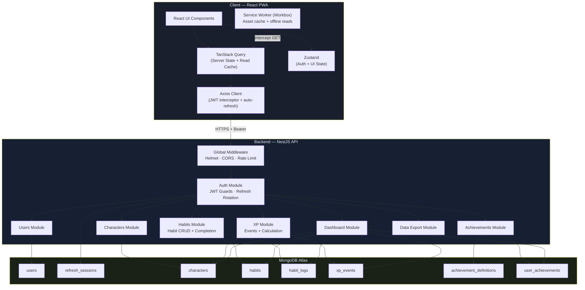
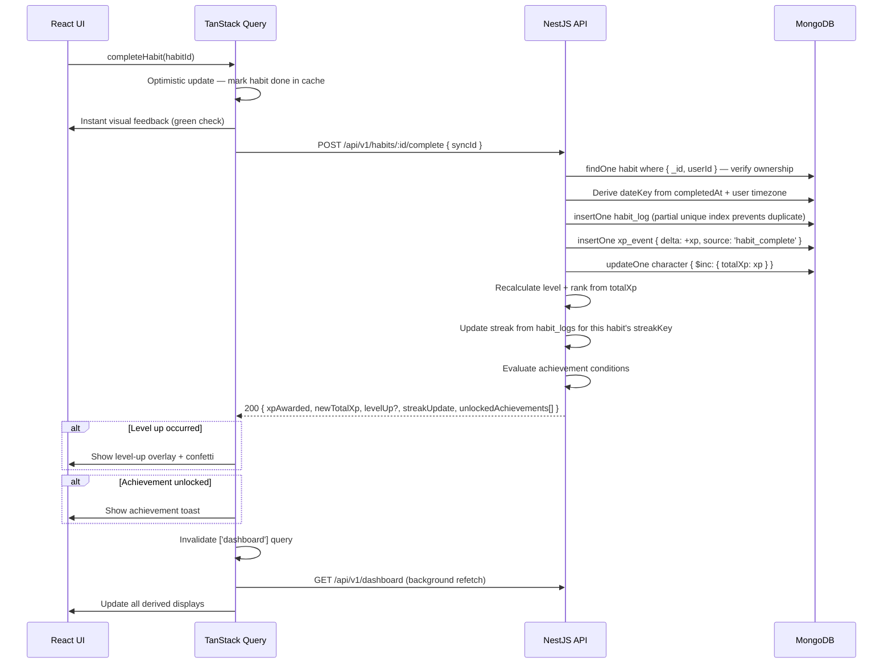
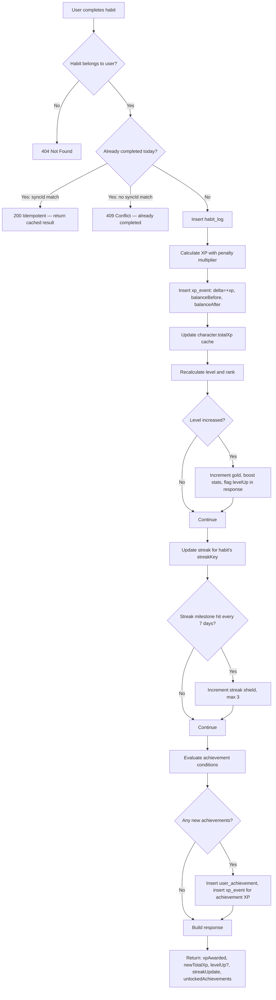
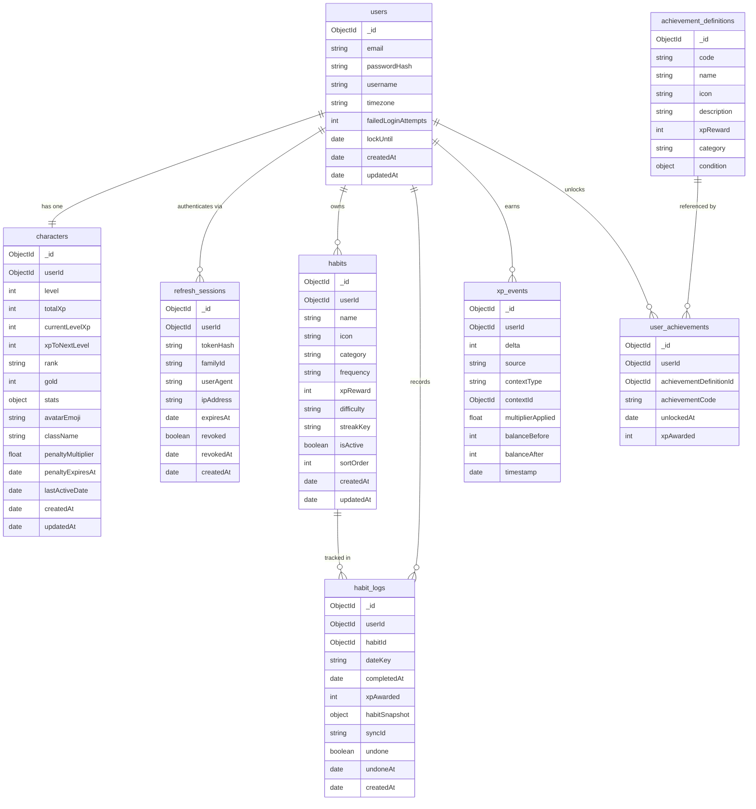

# Life RPG — MVP Technical Design

**Document version:** 1.0  
**Date:** 2026-06-17  
**Status:** Pre-implementation MVP blueprint  
**Prerequisite:** `LIFE_RPG_SYSTEM_ENHANCEMENT_PLAN.md` — read that first for full system analysis

---

## Table of Contents

1. [MVP Scope](#1-mvp-scope)
2. [MVP Architecture](#2-mvp-architecture)
3. [Domain Model](#3-domain-model)
4. [MongoDB Schema Design](#4-mongodb-schema-design)
5. [Index Strategy](#5-index-strategy)
6. [API Contract Design](#6-api-contract-design)
7. [Important Business Logic](#7-important-business-logic)
8. [Security Design](#8-security-design)
9. [Frontend MVP Design](#9-frontend-mvp-design)
10. [Backend MVP Design](#10-backend-mvp-design)
11. [MVP Build Phases](#11-mvp-build-phases)
12. [Future Scaling Plan](#12-future-scaling-plan)
13. [Final Recommendations](#13-final-recommendations)

---

## 1. MVP Scope

### 1.1 Design Philosophy

The MVP is an **online-first web app with PWA installability**. It replaces the localStorage-only single-file app with a proper backend, real authentication, a real database, and clean architecture. It does not try to build everything at once.

The data model is designed so future offline sync, boss battles, and advanced features slot in cleanly — without requiring schema migrations or architectural rewrites.

**Guiding constraints:**
- If a feature requires complex state reconciliation, defer it
- If a feature has no impact on daily habit tracking, defer it
- Every included feature must be correct and secure, not just present
- The code should be something you'd be proud to show in a job interview

### 1.2 What Is Included in MVP

| Feature | Notes |
|---|---|
| User registration | Email + password |
| User login / logout | JWT access token + refresh cookie |
| Refresh token flow | Auto-refresh in Axios interceptor |
| User profile | Username, email, timezone |
| Character profile | Level, XP, rank, stats, gold, avatar emoji |
| Default seeded habits | Migrated from current 10 daily + 5 weekly hardcoded habits |
| Custom habit CRUD | Create, read, update, soft-delete user-defined habits |
| Daily habit completion | Toggle-complete with XP award |
| Undo habit completion | Same-day undo only |
| Weekly habit tracking | Simple completion count toward weekly target |
| XP gain from completions | With penalty multiplier support |
| XP event history | `xp_events` append-only log |
| Level / rank calculation | Server-authoritative |
| Achievement evaluation | Server-side, structured conditions, no JS functions |
| Dashboard summary | Single endpoint: character + today's habits + streaks + recent XP |
| Streak tracking | Derived from `habit_logs` on each habit completion |
| Streak shields | Earned every 7 days, max 3, same logic as current app |
| Data export | Full JSON export endpoint |
| Basic PWA installability | Proper SW via vite-plugin-pwa, real PNG icons |
| Offline read cache | TanStack Query + stale-while-revalidate |
| Inactivity penalties | Server-side, applied on first login after gap |
| Account lockout | After 5 failed logins |
| Light/dark theme | Stored in user preferences server-side |

### 1.3 What Is Excluded from MVP (and Why)

| Excluded Feature | Why Deferred |
|---|---|
| **Full offline write sync** | Requires IndexedDB mutation queue, Workbox BackgroundSync, conflict resolution, and idempotent replay — significant complexity. The data model is ready for it via `syncId`, but the infrastructure is MVP+1. |
| **IndexedDB mutation queue** | Tied to offline write sync. Excluded alongside it. |
| **Push notifications** | Requires VAPID key management, service worker push handlers, iOS 16.4+ requirement, and opt-in flow. Deliver real value first, notifications are a retention feature. |
| **Boss battles** | Cosmetically impressive but not core to the daily habit loop. Excluded to keep the completion model simple. Will slot in later using existing habit-damage patterns. |
| **Email verification** | Adds email provider dependency (SendGrid, Resend) and verification flow complexity. Not needed for a personal-use app. **Include if you plan to open this to other users.** |
| **Password reset via email** | Same email provider dependency. The `forgotPassword` endpoint stub should be included in the API contract for future use, but not wired to an email provider in MVP. |
| **Social features / leaderboards** | Multi-user data exposure risks. Out of scope for personal productivity tool. |
| **Complex analytics** | `xp_events` and `habit_logs` already support this — build the queries later. |
| **Multiple characters** | One character per user is the right default. Multi-character adds selector UI and query complexity. |
| **Apple Health / Google Fit** | Platform APIs, OAuth scopes, and data normalization work. Future feature. |
| **Skill tree state** | The current skill trees are purely informational (never written to `S.skills`). Keep them as read-only display in MVP. |
| **Workbox BackgroundSync** | Defer with offline write sync. |
| **Penalty feature flags** | Current penalty logic (inactivity XP deductions) is kept but simplified — penalties apply only on login, server-side. |

---

## 2. MVP Architecture

### 2.1 MVP Architecture Diagram



### 2.2 Authentication Flow

```mermaid
sequenceDiagram
    participant C as React PWA
    participant AX as Axios Interceptor
    participant API as NestJS API
    participant DB as MongoDB

    Note over C,DB: Registration
    C->>API: POST /api/v1/auth/register { email, password, username, timezone }
    API->>API: Validate DTO, bcrypt hash password (cost 12)
    API->>DB: Insert user + seed default habits + create character
    API-->>C: 201 { userId, email, username }

    Note over C,DB: Login
    C->>API: POST /api/v1/auth/login { email, password }
    API->>DB: findOne user by email
    API->>API: bcrypt.compare, check lockout
    API->>DB: Insert refresh_session { tokenHash, familyId }
    API-->>C: 200 { accessToken } + Set-Cookie: rt=<token>; HttpOnly; Secure; SameSite=Strict; Path=/api/v1/auth/refresh

    Note over C,API: Authenticated requests
    C->>AX: API call needed
    AX->>API: GET /api/v1/dashboard  Authorization: Bearer <accessToken>
    API->>API: JwtGuard validates signature + expiry
    API-->>C: 200 { ...dashboardData }

    Note over C,API: Token expired — auto-refresh
    AX->>API: GET /api/v1/habits  (accessToken expired)
    API-->>AX: 401 Unauthorized
    AX->>API: POST /api/v1/auth/refresh  (cookie sent automatically)
    API->>DB: Validate tokenHash, check revoked + expiry
    API->>DB: Revoke old session, insert new session (rotation)
    API-->>AX: 200 { accessToken: newToken } + Set-Cookie: rt=<newToken>
    AX->>API: GET /api/v1/habits  (retry with new token)
    API-->>C: 200 { habits[] }

    Note over C,DB: Logout
    C->>API: POST /api/v1/auth/logout  (cookie auto-sent)
    API->>DB: Mark session revoked
    API-->>C: 200 {} + Set-Cookie: rt=; Max-Age=0
```

### 2.3 Habit Completion Flow



### 2.4 XP Event Flow



### 2.5 Entity Relationship Diagram



### 2.6 Deployment Architecture

```
┌─────────────────────────────────────────────────────────┐
│  Vercel / Netlify (Frontend)                             │
│  React + Vite bundle (static files)                     │
│  service-worker.js (Workbox)                            │
│  manifest.webmanifest + PNG icons                       │
│  Global CDN edge distribution                           │
└───────────────────┬─────────────────────────────────────┘
                    │ HTTPS  /api/v1/*
┌───────────────────▼─────────────────────────────────────┐
│  Railway / Render (Backend)                              │
│  NestJS on Node 20 LTS  PORT 3001                       │
│  CORS: [https://liferpg.app]                            │
│  Rate limiting in-memory (throttler)                    │
│  Helmet security headers                                │
└───────────────────┬─────────────────────────────────────┘
                    │ MongoDB TLS
┌───────────────────▼─────────────────────────────────────┐
│  MongoDB Atlas M0 (free) → M10 when needed              │
│  Collections: users, refresh_sessions, characters,      │
│               habits, habit_logs, xp_events,            │
│               achievement_definitions, user_achievements │
└─────────────────────────────────────────────────────────┘
```

---

## 3. Domain Model

### 3.1 User

**Purpose:** Authentication identity and account owner. Every other document references this via `userId`.

| Field | Type | Rule |
|---|---|---|
| `email` | string | Unique, lowercase, RFC 5322 |
| `passwordHash` | string | bcrypt cost 12; never returned to client |
| `username` | string | Unique, 3–30 chars, alphanumeric + underscore |
| `timezone` | string | IANA timezone (e.g. `"Asia/Colombo"`); server uses this for all `dateKey` derivation |
| `failedLoginAttempts` | int | Reset on success; triggers lockout at 5 |
| `lockUntil` | Date\|null | Null when not locked |

**Business rules:**
- Email cannot be changed after registration in MVP (future feature)
- Username can be changed (no history needed)
- Timezone is critical — every `dateKey` in the system is derived using this value

**Not user-editable (server-owned):** `passwordHash`, `failedLoginAttempts`, `lockUntil`

**Future expansion:** email verification, OAuth providers, avatar upload URL

---

### 3.2 Character

**Purpose:** The user's RPG identity. One character per user. Caches derived XP state for fast reads.

| Field | Type | Rule |
|---|---|---|
| `userId` | ObjectId | Unique — one character per user |
| `level` | int | ≥ 1; derived from `totalXp` |
| `totalXp` | int | ≥ 0; cached sum of all `xp_events.delta` |
| `currentLevelXp` | int | XP within the current level; `totalXp - xpFloor(level)` |
| `xpToNextLevel` | int | `level * 500` |
| `rank` | string | Derived from level; one of 7 ranks |
| `gold` | int | Earned on level-up: `level * 10` gold per level |
| `stats` | object | `{ STR, INT, WIS, DEX, CHA, END }` — all start at 10 |
| `penaltyMultiplier` | float | `1.0` normally; `0.9` during shame debuff |
| `penaltyExpiresAt` | Date\|null | When debuff ends |
| `lastActiveDate` | string | `YYYY-MM-DD` in user's timezone; used for penalty gap calculation |

**Source of truth vs cache:** `totalXp` is a materialized cache. The authoritative source is `SUM(xp_events.delta) WHERE userId = X`. If they diverge (bug or crash mid-write), recalculate from events.

**Future expansion:** multiple characters, character class abilities affecting XP multipliers

---

### 3.3 Habit

**Purpose:** A user-defined repeatable task. Replaces the hardcoded `DAILY_Q` and `WEEKLY_Q` constants.

| Field | Type | Rule |
|---|---|---|
| `userId` | ObjectId | Owner |
| `name` | string | 1–100 chars; no HTML |
| `icon` | string | Emoji; 1–4 chars |
| `category` | enum | `fitness \| coding \| reading \| career \| wellness \| custom` |
| `frequency` | enum | `daily \| weekly` |
| `xpReward` | int | 1–500 for daily; 1–1000 for weekly |
| `difficulty` | enum | `easy \| medium \| hard \| legendary` |
| `streakKey` | string\|null | Links to streak tracking; e.g. `"gym"`, `"code"`. MVP: shared keys between habits aggregate into one streak |
| `isActive` | bool | Soft delete flag |
| `sortOrder` | int | User-defined display order |

**Business rules:**
- Max 50 active habits per user (prevents abuse)
- Soft-delete only: `isActive: false`. Logs remain queryable for history.
- `xpReward` can be edited; `habit_logs` store a snapshot of `xpReward` at completion time so history is accurate

**On registration:** Server seeds default habits from the current 10 daily + 5 weekly constants.

**Future expansion:** habit groups, required habit chains, `weeklyTarget` count, boss damage linkage

---

### 3.4 HabitLog

**Purpose:** Immutable record of every habit completion (and undo). This is the source of truth for: what was completed, when, how much XP was awarded, and whether it was undone.

| Field | Type | Rule |
|---|---|---|
| `userId` | ObjectId | Owner |
| `habitId` | ObjectId | Reference to habit |
| `dateKey` | string | `YYYY-MM-DD` in user's timezone; derived by server |
| `completedAt` | Date | UTC timestamp |
| `xpAwarded` | int | Actual XP after penalty multiplier |
| `habitSnapshot` | object | `{ name, category, difficulty, xpReward }` at time of completion |
| `syncId` | string | UUID v4; client-generated idempotency key |
| `undone` | bool | Whether this completion was undone |
| `undoneAt` | Date\|null | When undo happened |

**Why `habitSnapshot`?** The habit's name or XP value may change later. The log must accurately reflect what was rewarded at completion time. Without a snapshot, the history screen would show today's XP for yesterday's logs — wrong.

**Source of truth for:** daily completion state, streak calculation, heatmap, activity history

---

### 3.5 XpEvent

**Purpose:** Append-only audit log of every XP change in the system. Never updated or deleted.

| Field | Type | Rule |
|---|---|---|
| `userId` | ObjectId | Owner |
| `delta` | int | Positive or negative |
| `source` | enum | See below |
| `contextType` | string | Collection name of context document |
| `contextId` | ObjectId | ID of the triggering document |
| `multiplierApplied` | float | Penalty multiplier at time of event |
| `balanceBefore` | int | `character.totalXp` before this event |
| `balanceAfter` | int | `character.totalXp` after this event |
| `timestamp` | Date | Server time |

**Source enum values:** `habit_complete`, `habit_undo`, `achievement_unlock`, `penalty_inactivity`, `penalty_missed_gym`, `penalty_missed_code`, `shame_debuff_active`

**Key rule:** XP cannot go below 0. If a penalty would make `totalXp` negative, floor it at 0.

**Source of truth for:** XP history, audit, recalculation from scratch if character cache drifts

---

### 3.6 AchievementDefinition

**Purpose:** Seed data defining every achievement. Stored in DB (not hardcoded in JS) so the server can evaluate conditions without running client-supplied code.

| Field | Type | Rule |
|---|---|---|
| `code` | string | Unique slug, e.g. `"first_q"`, `"streak7"` |
| `name` | string | Display name |
| `icon` | string | Emoji |
| `description` | string | Player-facing description |
| `xpReward` | int | XP awarded on unlock |
| `category` | string | `general \| fitness \| coding \| career \| milestone` |
| `condition` | object | Structured condition evaluated server-side |

**Condition object examples:**
```json
{ "type": "totalHabitsCompleted_gte", "threshold": 1 }
{ "type": "streakForKey_gte", "streakKey": "gym", "threshold": 7 }
{ "type": "level_gte", "threshold": 5 }
{ "type": "habitCategory_count_gte", "category": "fitness", "threshold": 30 }
```

**Why not JS check functions?** The current `check: s => s.meta.totalDone >= 1` is a function evaluated in the browser against client-mutable state. In the new system, the server evaluates structured conditions against authoritative DB data — no way to cheat, no code injection risk.

---

### 3.7 UserAchievement

**Purpose:** Record which achievements a user has unlocked and when.

| Field | Type | Rule |
|---|---|---|
| `userId` | ObjectId | Owner |
| `achievementDefinitionId` | ObjectId | Reference to definition |
| `achievementCode` | string | Denormalized for fast lookup without join |
| `unlockedAt` | Date | Server timestamp |
| `xpAwarded` | int | Snapshot of xpReward at unlock time |

**Business rule:** Unique per `(userId, achievementDefinitionId)` — enforced by unique index.

---

### 3.8 RefreshSession

**Purpose:** Server-side record of an active refresh token. Enables revocation, family-based theft detection, and multi-device session management.

| Field | Type | Rule |
|---|---|---|
| `userId` | ObjectId | Owner |
| `tokenHash` | string | SHA-256 of the refresh token; never store plain token |
| `familyId` | string | UUID; all rotations from one login share a family |
| `userAgent` | string | For display in future sessions list |
| `ipAddress` | string | Audit log only; not used for authorization |
| `expiresAt` | Date | TTL index will auto-delete after expiry |
| `revoked` | bool | Immediate revocation without waiting for TTL |

**Theft detection:** If a refresh token is presented that was already rotated (the old token in a family chain is replayed), the server detects the family conflict and revokes all sessions in that family immediately.

---

## 4. MongoDB Schema Design

### 4.1 Collection: `users`

```js
{
  _id: ObjectId("..."),
  email: "yomal@example.com",       // lowercase, trimmed
  passwordHash: "$2b$12$...",        // bcrypt; never select this in responses
  username: "TheArchitect",
  timezone: "Asia/Colombo",          // IANA; default "UTC"
  failedLoginAttempts: 0,
  lockUntil: null,                   // Date | null
  createdAt: ISODate("2026-06-17T06:00:00Z"),
  updatedAt: ISODate("2026-06-17T06:00:00Z"),
}
```

### 4.2 Collection: `refresh_sessions`

```js
{
  _id: ObjectId("..."),
  userId: ObjectId("..."),
  tokenHash: "sha256hex...",         // SHA-256(refreshToken), hex string
  familyId: "uuid-v4",              // groups tokens from same login
  userAgent: "Mozilla/5.0 ...",
  ipAddress: "203.0.113.1",
  expiresAt: ISODate("2026-06-24T06:00:00Z"),
  revoked: false,
  revokedAt: null,
  createdAt: ISODate("2026-06-17T06:00:00Z"),
}
```

### 4.3 Collection: `characters`

```js
{
  _id: ObjectId("..."),
  userId: ObjectId("..."),
  level: 1,
  totalXp: 0,                        // cached; source of truth is xp_events
  currentLevelXp: 0,                 // totalXp - xpFloor(level)
  xpToNextLevel: 500,                // level * 500
  rank: "Bronze",
  gold: 0,
  stats: { STR: 10, INT: 10, WIS: 10, DEX: 10, CHA: 10, END: 10 },
  avatarEmoji: "⚔️",
  className: "Software Engineer — Full-Stack",
  penaltyMultiplier: 1.0,
  penaltyExpiresAt: null,
  lastActiveDate: null,              // "YYYY-MM-DD" in user's timezone
  createdAt: ISODate("2026-06-17T06:00:00Z"),
  updatedAt: ISODate("2026-06-17T06:00:00Z"),
}
```

### 4.4 Collection: `habits`

```js
{
  _id: ObjectId("..."),
  userId: ObjectId("..."),
  name: "Gym Session",
  icon: "🏋️",
  category: "fitness",
  frequency: "daily",
  xpReward: 50,
  difficulty: "medium",
  streakKey: "gym",                  // null for habits that don't affect streaks
  isActive: true,
  sortOrder: 0,
  createdAt: ISODate("2026-06-17T06:00:00Z"),
  updatedAt: ISODate("2026-06-17T06:00:00Z"),
}
```

### 4.5 Collection: `habit_logs`

```js
{
  _id: ObjectId("..."),
  userId: ObjectId("..."),
  habitId: ObjectId("..."),
  dateKey: "2026-06-17",            // derived by server from completedAt + user timezone
  completedAt: ISODate("2026-06-17T08:30:00Z"),
  xpAwarded: 45,                    // after penaltyMultiplier
  habitSnapshot: {
    name: "Gym Session",
    category: "fitness",
    difficulty: "medium",
    xpReward: 50,                   // base before multiplier
  },
  syncId: "550e8400-e29b-41d4-a716-446655440000",
  undone: false,
  undoneAt: null,
  createdAt: ISODate("2026-06-17T08:30:00Z"),
}
```

### 4.6 Collection: `xp_events`

```js
{
  _id: ObjectId("..."),
  userId: ObjectId("..."),
  delta: 45,                         // positive = gain, negative = loss
  source: "habit_complete",
  contextType: "habit_logs",
  contextId: ObjectId("..."),        // the habit_log that triggered this
  multiplierApplied: 0.9,
  balanceBefore: 1200,
  balanceAfter: 1245,
  timestamp: ISODate("2026-06-17T08:30:00Z"),
}
```

### 4.7 Collection: `achievement_definitions`

```js
{
  _id: ObjectId("..."),
  code: "streak7",
  name: "Week Warrior",
  icon: "🗓️",
  description: "7-day streak on any activity",
  xpReward: 150,
  category: "general",
  condition: {
    type: "anyStreak_gte",
    threshold: 7
  },
}
```

**All 15 conditions mapped from current app:**

| Achievement Code | Condition Object |
|---|---|
| `first_q` | `{ type: "totalHabitsCompleted_gte", threshold: 1 }` |
| `streak3` | `{ type: "anyStreak_gte", threshold: 3 }` |
| `streak7` | `{ type: "anyStreak_gte", threshold: 7 }` |
| `streak30` | `{ type: "anyStreak_gte", threshold: 30 }` |
| `gym30` | `{ type: "habitCategory_count_gte", category: "fitness", threshold: 30 }` |
| `lc50` | `{ type: "habitName_count_gte", nameContains: "LeetCode", threshold: 50 }` |
| `read20` | `{ type: "habitCategory_count_gte", category: "reading", threshold: 20 }` |
| `lv5` | `{ type: "level_gte", threshold: 5 }` |
| `lv10` | `{ type: "level_gte", threshold: 10 }` |
| `lv20` | `{ type: "level_gte", threshold: 20 }` |
| `job10` | `{ type: "habitCategory_count_gte", category: "career", threshold: 10 }` |
| `gold_rank` | `{ type: "rank_in", values: ["Gold","Platinum","Diamond","Legendary"] }` |
| `shield_use` | `{ type: "totalShieldsUsed_gte", threshold: 1 }` |
| `perf_week` | `{ type: "perfectDaysConsecutive_gte", threshold: 7 }` |
| `boss_kill` | `{ type: "always_false" }` *(bosses excluded from MVP; achievement inert)* |

### 4.8 Collection: `user_achievements`

```js
{
  _id: ObjectId("..."),
  userId: ObjectId("..."),
  achievementDefinitionId: ObjectId("..."),
  achievementCode: "streak7",       // denormalized for fast lookup
  unlockedAt: ISODate("2026-06-17T09:00:00Z"),
  xpAwarded: 150,
}
```

---

## 5. Index Strategy

### 5.1 `users`

```js
// Login lookup (most frequent)
db.users.createIndex({ email: 1 }, { unique: true })

// Username uniqueness check
db.users.createIndex({ username: 1 }, { unique: true })
```

### 5.2 `refresh_sessions`

```js
// Token validation (every refresh call)
db.refresh_sessions.createIndex({ tokenHash: 1 }, { unique: true })

// Revoke all sessions for a user (logout-all)
db.refresh_sessions.createIndex({ userId: 1, revoked: 1 })

// Family tracking (theft detection)
db.refresh_sessions.createIndex({ familyId: 1 })

// Auto-delete expired sessions (TTL)
db.refresh_sessions.createIndex(
  { expiresAt: 1 },
  { expireAfterSeconds: 0 }
)
```

### 5.3 `characters`

```js
// One character per user
db.characters.createIndex({ userId: 1 }, { unique: true })
```

### 5.4 `habits`

```js
// Fetch active daily/weekly habits for a user (most common read)
db.habits.createIndex({ userId: 1, frequency: 1, isActive: 1 })

// Fetch habits by category
db.habits.createIndex({ userId: 1, category: 1, isActive: 1 })
```

### 5.5 `habit_logs`

```js
// Today's completions for dashboard (most frequent read)
db.habit_logs.createIndex({ userId: 1, dateKey: 1 })

// Habit history for a specific habit
db.habit_logs.createIndex({ userId: 1, habitId: 1, dateKey: -1 })

// CRITICAL: Prevent duplicate active completions
// A user can only complete the same habit on the same date once (unless undone)
// undone: false means the index is sparse — undone logs don't count
db.habit_logs.createIndex(
  { userId: 1, habitId: 1, dateKey: 1 },
  {
    unique: true,
    partialFilterExpression: { undone: false },
    name: "habit_logs_no_duplicate_active"
  }
)

// Idempotent sync replay via syncId
db.habit_logs.createIndex(
  { syncId: 1 },
  { unique: true, sparse: true }
)
```

**Why the partial unique index?** If a user completes habit A on June 17, then undoes it (sets `undone: true`), and then re-completes it the same day, that should be allowed — it's two different documents, the first with `undone: true` (excluded from the partial index), the second with `undone: false` (included). Without the partial filter, undoing and re-doing would fail the unique constraint.

### 5.6 `xp_events`

```js
// XP history (most recent first) — used for event feed and recalculation
db.xp_events.createIndex({ userId: 1, timestamp: -1 })

// Analytics by XP source
db.xp_events.createIndex({ userId: 1, source: 1 })
```

### 5.7 `achievement_definitions`

```js
// Look up by code (seeding check, condition evaluation)
db.achievement_definitions.createIndex({ code: 1 }, { unique: true })
```

### 5.8 `user_achievements`

```js
// Prevent duplicate achievement unlocks
db.user_achievements.createIndex(
  { userId: 1, achievementDefinitionId: 1 },
  { unique: true }
)

// Fetch all achievements for a user
db.user_achievements.createIndex({ userId: 1, unlockedAt: -1 })
```

---

## 6. API Contract Design

### 6.1 Base URL and Conventions

```
Base: /api/v1
Content-Type: application/json
Auth: Authorization: Bearer <accessToken>  (all protected endpoints)

Standard error shape:
{
  "statusCode": 400,
  "message": "Validation failed",
  "errors": [{ "field": "email", "message": "must be a valid email" }],
  "timestamp": "2026-06-17T06:00:00Z",
  "path": "/api/v1/auth/register"
}
```

---

### 6.2 Auth Endpoints

#### `POST /api/v1/auth/register`

**Purpose:** Create a new account. Seeds default habits and creates character.

**Request:**
```json
{
  "email": "yomal@example.com",
  "password": "MySecurePass123!",
  "username": "TheArchitect",
  "timezone": "Asia/Colombo"
}
```

**Response `201`:**
```json
{
  "userId": "...",
  "email": "yomal@example.com",
  "username": "TheArchitect"
}
```

**Validation:** email format; password 8–72 chars; username 3–30 alphanum+underscore; timezone must be valid IANA string.  
**Rate limit:** 5 / 15 min per IP.  
**Side effects:** Inserts user, character (level 1), and 15 default habits.  
**Error cases:** `409` if email or username taken; `400` on validation failure.

---

#### `POST /api/v1/auth/login`

**Purpose:** Authenticate and issue tokens.

**Request:**
```json
{ "email": "yomal@example.com", "password": "MySecurePass123!" }
```

**Response `200` + `Set-Cookie: rt=<token>; HttpOnly; Secure; SameSite=Strict; Path=/api/v1/auth/refresh; Max-Age=604800`:**
```json
{ "accessToken": "<jwt>" }
```

**Rate limit:** 10 / 15 min per IP.  
**Lockout:** After 5 failures, return `429` and set `lockUntil = now + 15min`.  
**Error cases:** `401` with message `"Invalid email or password"` for both wrong email AND wrong password (no enumeration).

---

#### `POST /api/v1/auth/refresh`

**Purpose:** Exchange a valid refresh token cookie for a new access token.

**Request:** No body. Cookie sent automatically by browser.

**Response `200` + rotated `Set-Cookie`:**
```json
{ "accessToken": "<new_jwt>" }
```

**Auth:** Cookie-based only. Does NOT use Bearer token.  
**Rotation:** Old refresh session is revoked; new one is inserted. Same `familyId`.  
**Theft detection:** If the presented token's session is already revoked (replay attack), revoke all sessions in the family.  
**Error cases:** `401` if cookie missing, invalid, expired, or revoked.

---

#### `POST /api/v1/auth/logout`

**Purpose:** Revoke current refresh token and clear cookie.

**Request:** No body. Cookie sent automatically.  
**Response `200`:** `{}` + `Set-Cookie: rt=; Max-Age=0`  
**Auth:** Cookie-based.

---

#### `POST /api/v1/auth/logout-all`

**Purpose:** Revoke all refresh sessions for this user (all devices).

**Auth:** Bearer token.  
**Response `200`:** `{ "sessionsRevoked": 3 }`

---

### 6.3 User Endpoints

#### `GET /api/v1/users/me`

**Auth:** Bearer  
**Response `200`:**
```json
{
  "userId": "...",
  "email": "yomal@example.com",
  "username": "TheArchitect",
  "timezone": "Asia/Colombo",
  "createdAt": "2026-06-17T06:00:00Z"
}
```
**Never returns:** `passwordHash`, `failedLoginAttempts`, `lockUntil`

---

#### `PATCH /api/v1/users/me`

**Auth:** Bearer  
**Request:**
```json
{
  "username": "NewName",
  "timezone": "America/New_York"
}
```
**Validation:** All fields optional; username 3–30 chars; timezone IANA enum.  
**Response `200`:** Updated user object (same shape as GET).

---

### 6.4 Character Endpoints

#### `GET /api/v1/character`

**Auth:** Bearer  
**Response `200`:**
```json
{
  "level": 3,
  "totalXp": 2150,
  "currentLevelXp": 650,
  "xpToNextLevel": 1500,
  "rank": "Bronze",
  "gold": 60,
  "stats": { "STR": 12, "INT": 11, "WIS": 10, "DEX": 10, "CHA": 10, "END": 10 },
  "avatarEmoji": "⚔️",
  "className": "Software Engineer — Full-Stack",
  "penaltyActive": false,
  "penaltyExpiresAt": null
}
```

---

#### `PATCH /api/v1/character`

**Auth:** Bearer  
**Request:**
```json
{ "avatarEmoji": "🧙", "className": "Backend Engineer" }
```
**Validation:** `avatarEmoji` max 4 chars; `className` max 60 chars.

---

### 6.5 Habits CRUD

#### `GET /api/v1/habits`

**Auth:** Bearer  
**Query params:** `?frequency=daily&active=true`  
**Response `200`:**
```json
{
  "habits": [
    {
      "id": "...",
      "name": "Gym Session",
      "icon": "🏋️",
      "category": "fitness",
      "frequency": "daily",
      "xpReward": 50,
      "difficulty": "medium",
      "streakKey": "gym",
      "isActive": true,
      "sortOrder": 0,
      "completedToday": false
    }
  ]
}
```
**Note:** `completedToday` is computed by joining with `habit_logs` for today's `dateKey`. This avoids a separate API call.

---

#### `POST /api/v1/habits`

**Auth:** Bearer  
**Request:**
```json
{
  "name": "Gym Session",
  "icon": "🏋️",
  "category": "fitness",
  "frequency": "daily",
  "xpReward": 50,
  "difficulty": "medium",
  "streakKey": "gym"
}
```
**Validation:** `name` 1–100 chars; `xpReward` 1–500 (daily) or 1–1000 (weekly); `category` and `frequency` must be valid enum values.  
**Limit:** Max 50 active habits per user. Return `422` if exceeded.  
**Response `201`:** Full habit object.

---

#### `GET /api/v1/habits/:id`

**Auth:** Bearer  
**Authorization:** Returns `404` if habit doesn't exist or belongs to another user.  
**Response `200`:** Full habit object.

---

#### `PATCH /api/v1/habits/:id`

**Auth:** Bearer  
**Request:** Any subset of habit fields (name, icon, xpReward, isActive, sortOrder, streakKey).  
**Restriction:** Cannot change `frequency` after creation (would invalidate historical logs).

---

#### `DELETE /api/v1/habits/:id`

**Auth:** Bearer  
**Behavior:** Soft-delete — sets `isActive: false`. Historical `habit_logs` are preserved.  
**Response `204`:** No body.

---

### 6.6 Habit Completion

#### `POST /api/v1/habits/:id/complete`

**Auth:** Bearer  
**Request:**
```json
{
  "syncId": "550e8400-e29b-41d4-a716-446655440000",
  "completedAt": "2026-06-17T08:30:00.000Z"  // optional; defaults to server time
}
```

**Response `200`:**
```json
{
  "habitLogId": "...",
  "xpAwarded": 45,
  "newTotalXp": 1245,
  "previousLevel": 3,
  "newLevel": 3,
  "levelUp": false,
  "newRank": "Bronze",
  "streakUpdate": {
    "streakKey": "gym",
    "newCount": 8,
    "shieldEarned": true
  },
  "unlockedAchievements": []
}
```

**Idempotency:** If `syncId` already exists in `habit_logs`, return `200` with the original result.  
**Duplicate prevention:** If same `(userId, habitId, dateKey)` already has an active (non-undone) log, return `409 Conflict`.  
**Validation:** `completedAt` must be within 48 hours of server time; `syncId` must be UUID v4.  
**Authorization:** 404 if habit belongs to another user.

---

#### `POST /api/v1/habits/:id/undo`

**Auth:** Bearer  
**Request:**
```json
{ "dateKey": "2026-06-17" }
```

**Response `200`:**
```json
{
  "xpReverted": 45,
  "newTotalXp": 1200,
  "newLevel": 3
}
```

**Business rule:** Can only undo a completion for the **current day** in the user's timezone. Past days are locked. This prevents XP manipulation via retroactive undos.  
**Side effects:** Sets `habit_log.undone = true`; inserts negative `xp_event`; updates `character.totalXp`.  
**Error:** `404` if no active completion found for this habit today.

---

#### `GET /api/v1/habits/:id/logs`

**Auth:** Bearer  
**Query:** `?from=2026-06-01&to=2026-06-17&limit=30`  
**Response `200`:**
```json
{
  "logs": [
    {
      "id": "...",
      "dateKey": "2026-06-17",
      "completedAt": "2026-06-17T08:30:00Z",
      "xpAwarded": 45,
      "undone": false,
      "habitSnapshot": { "name": "Gym Session", "xpReward": 50 }
    }
  ]
}
```

---

### 6.7 XP Endpoints

#### `GET /api/v1/xp/events`

**Auth:** Bearer  
**Query:** `?limit=50&cursor=<ObjectId>`  
**Response `200`:**
```json
{
  "events": [
    {
      "id": "...",
      "delta": 45,
      "source": "habit_complete",
      "contextType": "habit_logs",
      "contextId": "...",
      "balanceBefore": 1200,
      "balanceAfter": 1245,
      "timestamp": "2026-06-17T08:30:00Z"
    }
  ],
  "nextCursor": "..."
}
```

---

#### `GET /api/v1/xp/summary`

**Auth:** Bearer  
**Response `200`:**
```json
{
  "today": 95,
  "week": 420,
  "month": 1800,
  "total": 12450,
  "bySource": {
    "habit_complete": 12000,
    "achievement_unlock": 350,
    "penalty_inactivity": -200
  }
}
```

---

### 6.8 Achievements

#### `GET /api/v1/achievements`

**Auth:** Bearer  
**Response `200`:**
```json
{
  "definitions": [
    {
      "code": "first_q",
      "name": "First Blood",
      "icon": "⚔️",
      "description": "Complete your first quest",
      "xpReward": 50,
      "category": "general"
    }
  ],
  "unlocked": [
    {
      "code": "first_q",
      "unlockedAt": "2026-06-17T08:30:00Z",
      "xpAwarded": 50
    }
  ]
}
```

---

### 6.9 Dashboard

#### `GET /api/v1/dashboard`

**Auth:** Bearer  
**Purpose:** Primary endpoint called on app open. Aggregates everything needed for initial render.

**Response `200`:**
```json
{
  "character": {
    "level": 3,
    "totalXp": 1245,
    "currentLevelXp": 245,
    "xpToNextLevel": 1500,
    "rank": "Bronze",
    "gold": 30,
    "stats": { "STR": 11, "INT": 10, "WIS": 10, "DEX": 10, "CHA": 10, "END": 10 },
    "avatarEmoji": "⚔️",
    "className": "Software Engineer — Full-Stack",
    "penaltyActive": false
  },
  "todayHabits": [
    {
      "id": "...",
      "name": "Gym Session",
      "icon": "🏋️",
      "xpReward": 50,
      "category": "fitness",
      "frequency": "daily",
      "completedToday": false,
      "streakKey": "gym"
    }
  ],
  "weeklyHabits": [
    {
      "id": "...",
      "name": "3 Gym Sessions",
      "xpReward": 150,
      "target": 3,
      "progress": 1,
      "completed": false
    }
  ],
  "streaks": [
    { "streakKey": "gym", "current": 7, "shields": 1 },
    { "streakKey": "code", "current": 3, "shields": 0 },
    { "streakKey": "reading", "current": 0, "shields": 0 },
    { "streakKey": "earlyRise", "current": 14, "shields": 2 }
  ],
  "recentAchievements": [
    { "code": "streak7", "name": "Week Warrior", "icon": "🗓️", "unlockedAt": "..." }
  ],
  "xpToday": 95,
  "completedTodayCount": 4,
  "totalHabitsToday": 10,
  "penaltyApplied": null
}
```

**Implementation note:** This is a single aggregation. Run 5 parallel queries (character, todayHabits + todayLogs, weeklyHabits + weeklyLogs, streaks derived from logs, recent achievements) then merge. Use `Promise.all()` for parallelism.

**Daily reset check:** Before building the dashboard response, check if today's `dateKey` differs from `character.lastActiveDate`. If yes, apply penalties (if gap > 1 day), update `lastActiveDate`.

---

### 6.10 Data Export

#### `GET /api/v1/data/export`

**Auth:** Bearer  
**Rate limit:** 5 / 24 hours per user  
**Response `200`:** `Content-Type: application/json; Content-Disposition: attachment; filename="liferpg-backup-2026-06-17.json"`

```json
{
  "exportedAt": "2026-06-17T06:00:00Z",
  "version": "mvp-1.0",
  "user": { "username": "TheArchitect", "timezone": "Asia/Colombo" },
  "character": { "level": 3, "totalXp": 1245, "rank": "Bronze" },
  "habits": [...],
  "habitLogs": [...],
  "xpEvents": [...],
  "achievements": [...]
}
```

**Security:** Strips `passwordHash`, `tokenHash`, IP addresses from export.

---

## 7. Important Business Logic

### 7.1 Habit Completion Algorithm

```
function completeHabit(userId, habitId, syncId, completedAtUTC):

  1. Load user.timezone
  2. dateKey = toDateKey(completedAtUTC, user.timezone)
     // e.g. "2026-06-17" even if completedAtUTC is "2026-06-16T20:00:00Z" in UTC
     // but "2026-06-17T01:30:00+05:30" locally in Asia/Colombo
  
  3. Check: does habit_logs have { userId, habitId, dateKey, undone: false }?
     - If yes AND syncId matches existing log → return 200 idempotent result
     - If yes AND syncId doesn't match → return 409 Conflict
  
  4. Load habit (verify userId match → 404 if not found)
  5. Load character (verify userId match)
  
  6. effectiveXp = floor(habit.xpReward * character.penaltyMultiplier)
  
  7. INSERT habit_log {
       userId, habitId, dateKey,
       completedAt: completedAtUTC,
       xpAwarded: effectiveXp,
       habitSnapshot: { name, category, difficulty, xpReward: habit.xpReward },
       syncId, undone: false
     }
  
  8. balanceBefore = character.totalXp
     balanceAfter = balanceBefore + effectiveXp
  
  9. INSERT xp_event {
       userId, delta: effectiveXp, source: 'habit_complete',
       contextType: 'habit_logs', contextId: habitLog._id,
       multiplierApplied: character.penaltyMultiplier,
       balanceBefore, balanceAfter, timestamp: now
     }
  
  10. UPDATE character {
        totalXp: balanceAfter,
        currentLevelXp: calculateCurrentLevelXp(balanceAfter),
        level: calculateLevel(balanceAfter),
        rank: calculateRank(calculateLevel(balanceAfter)),
        gold: recalculateGold(oldLevel, newLevel, character.gold),
        stats: applyStatBoosts(oldLevel, newLevel, character.stats),
        lastActiveDate: dateKey
      }
  
  11. Recalculate streak for habit.streakKey (if not null)
  
  12. Evaluate achievement conditions → award any new achievements
  
  13. Return response
```

---

### 7.2 Undo Habit Completion

```
function undoHabit(userId, habitId, dateKey):

  1. Load user.timezone
  2. Verify dateKey == today's dateKey in user's timezone
     → If dateKey is in the past: return 422 "Can only undo today's completions"
  
  3. Find habit_log where { userId, habitId, dateKey, undone: false }
     → 404 if not found
  
  4. UPDATE habit_log { undone: true, undoneAt: now }
  
  5. xpToRevert = habitLog.xpAwarded (negative)
     INSERT xp_event { delta: -xpToRevert, source: 'habit_undo', ... }
  
  6. UPDATE character { totalXp: max(0, totalXp - xpToRevert) }
     Recalculate level, rank, currentLevelXp
     // Note: undo can lower a level. This is intentional.
  
  7. Return { xpReverted, newTotalXp, newLevel }
```

**Why same-day only?** Allowing retroactive undos creates XP manipulation opportunities. The current app also only allows same-day undo (toggling the checkbox back). Keep this constraint.

---

### 7.3 XP Calculation

```typescript
// XP needed to go from level N to level N+1
function xpForLevel(level: number): number {
  return level * 500;
}

// Total cumulative XP at the START of level N (i.e. XP floor for level N)
function xpFloorForLevel(level: number): number {
  // Sum of 500*i for i=1 to level-1  =  500 * level * (level-1) / 2
  return (500 * level * (level - 1)) / 2;
}

// Derive level from total XP
function levelFromTotalXp(totalXp: number): number {
  // Level N requires totalXp >= xpFloorForLevel(N)
  // Solve: 500 * L * (L-1) / 2 <= totalXp
  let level = 1;
  while (xpFloorForLevel(level + 1) <= totalXp) level++;
  return level;
}

// XP within the current level
function currentLevelXp(totalXp: number): number {
  const level = levelFromTotalXp(totalXp);
  return totalXp - xpFloorForLevel(level);
}
```

**Can XP go negative?** No. `character.totalXp` is always `max(0, totalXp + delta)`. Penalties are capped at the current XP balance.

**Rank thresholds** (same as current app, by level):

| Level | Rank |
|---|---|
| 0–4 | Bronze |
| 5–9 | Iron |
| 10–19 | Silver |
| 20–34 | Gold |
| 35–49 | Platinum |
| 50–74 | Diamond |
| 75+ | Legendary |

---

### 7.4 Inactivity Penalties

Called on the first authenticated request of a new day, before building the dashboard response.

```
function applyInactivityPenalties(character, userTimezone):

  todayKey = toDateKey(now, userTimezone)
  
  if character.lastActiveDate == null OR character.lastActiveDate == todayKey:
    return null  // no penalty
  
  gap = calendarDaysBetween(character.lastActiveDate, todayKey)
  
  if gap == 1:
    return null  // missed one day, no penalty in MVP
    // The current app penalizes for missing gym/code on 1-day gaps.
    // Simplify for MVP: only penalize 3+ day gaps.
  
  if gap >= 7:
    penalty = -min(500, character.totalXp)
    INSERT xp_event { delta: penalty, source: 'penalty_inactivity' }
    UPDATE character { totalXp: max(0, totalXp + penalty), penaltyMultiplier: 0.9, penaltyExpiresAt: now + 3 days }
    return { type: 'shame_debuff', gap, penalty }
  
  if gap >= 3:
    penalty = -min(100, character.totalXp)
    INSERT xp_event { delta: penalty, source: 'penalty_inactivity' }
    UPDATE character { totalXp: max(0, totalXp + penalty) }
    return { type: 'inactivity', gap, penalty }
  
  return null
```

**Debuff expiry:** Check `character.penaltyExpiresAt` on each login. If `now > penaltyExpiresAt`, reset `penaltyMultiplier = 1.0`, `penaltyExpiresAt = null`.

---

### 7.5 Streak Calculation

Streaks are derived from `habit_logs` in MVP. No separate streak cache collection. The trade-off: a slight performance cost on each completion (one extra aggregation query) in exchange for simplicity. Add a `streaks` cache collection when this becomes a bottleneck.

```
function updateStreak(userId, streakKey, dateKey, userTimezone):

  // Get all distinct dateKeys for habits with this streakKey, ordered desc
  recentDates = habit_logs.distinct('dateKey', {
    userId,
    'habitSnapshot exists for habits with streakKey': streakKey,  // join with habits
    undone: false
  }).sort(desc).limit(60)  // limit for performance
  
  // Also load current shield count from the most recent streak state
  // In MVP, store shield count on character in a streaks object:
  // character.streaks = { gym: { current, shields }, code: { ... } }
  
  currentStreak = character.streaks[streakKey]
  
  yesterdayKey = previousDay(dateKey, userTimezone)
  
  if dateKey already in recentDates:
    return currentStreak  // already counted today
  
  if yesterdayKey in recentDates OR currentStreak.current == 0:
    currentStreak.current++
  else if daysBetween(recentDates[0], dateKey) == 2 AND currentStreak.shields > 0:
    currentStreak.shields--
    currentStreak.current++
    // Shield consumed to bridge the 1-day gap
  else:
    currentStreak.current = 1  // broken
  
  if currentStreak.current % 7 == 0:
    currentStreak.shields = min(currentStreak.shields + 1, 3)
    shieldEarned = true
  
  UPDATE character.streaks[streakKey] = currentStreak
```

**Practical simplification for MVP:** Store streak state in `character.streaks` embedded object (not a separate collection). This avoids a sixth collection and a separate query pattern. Example:

```js
// Inside character document
streaks: {
  gym:       { current: 7, shields: 1 },
  code:      { current: 3, shields: 0 },
  reading:   { current: 0, shields: 0 },
  earlyRise: { current: 14, shields: 2 },
}
```

---

### 7.6 Achievement Evaluation

Called after every habit completion, undo, or level-up.

```typescript
async function evaluateAchievements(userId: string, context: AchievementContext) {
  const definitions = await achievementDefinitionModel.find();
  const alreadyUnlocked = await userAchievementModel.find({ userId });
  const unlockedCodes = new Set(alreadyUnlocked.map(ua => ua.achievementCode));

  const newUnlocks = [];

  for (const def of definitions) {
    if (unlockedCodes.has(def.code)) continue;
    if (await evaluateCondition(def.condition, userId, context)) {
      // Insert user_achievement
      // Insert xp_event for achievement XP
      // Update character.totalXp
      newUnlocks.push(def);
    }
  }
  return newUnlocks;
}

async function evaluateCondition(condition, userId, context) {
  switch (condition.type) {
    case 'totalHabitsCompleted_gte':
      const count = await habitLogModel.countDocuments({ userId, undone: false });
      return count >= condition.threshold;

    case 'level_gte':
      return context.character.level >= condition.threshold;

    case 'anyStreak_gte':
      const streaks = context.character.streaks;
      return Object.values(streaks).some((s: any) => s.current >= condition.threshold);

    case 'habitCategory_count_gte':
      const catCount = await habitLogModel.countDocuments({
        userId, undone: false,
        'habitSnapshot.category': condition.category
      });
      return catCount >= condition.threshold;

    case 'rank_in':
      return condition.values.includes(context.character.rank);

    case 'totalShieldsUsed_gte':
      // Sum shields used from character streak history (simple counter on character)
      return context.character.totalShieldsUsed >= condition.threshold;

    case 'perfectDaysConsecutive_gte':
      // Count consecutive days where ALL daily habits were completed
      // This is expensive in MVP — compute from calendar data
      // For MVP: track perfectDayStreak on character document
      return context.character.perfectDayStreak >= condition.threshold;

    case 'always_false':
      return false;

    default:
      return false;
  }
}
```

**Perfect day tracking:** After each habit completion, check if all daily habits for today are completed. If yes and `lastActiveDate != todayKey`, increment `character.perfectDayStreak`. If yesterday is not active, reset to 1. Store `perfectDayStreak` and `perfectDayStreakStartDate` on the character document.

---

### 7.7 Timezone and Daily Reset

**The current bug:** `new Date().toISOString().split('T')[0]` returns the UTC date. A user in `Asia/Colombo` (+5:30) opening the app at 11:30 PM local time will get `YYYY-MM-DD` that is already tomorrow in UTC. Their daily quests would reset 5.5 hours early.

**The fix:**
```typescript
import { formatInTimeZone } from 'date-fns-tz';

function toDateKey(utcDate: Date, timezone: string): string {
  return formatInTimeZone(utcDate, timezone, 'yyyy-MM-dd');
}

// Usage
const dateKey = toDateKey(new Date(), user.timezone);
// "2026-06-17" in Asia/Colombo, even if UTC shows "2026-06-16"
```

**Daily reset trigger:** The server checks on first authenticated call if `character.lastActiveDate !== today's dateKey`. If different, this is the first call of a new day — run penalty check, update `lastActiveDate`. The client never needs to manage reset logic.

---

## 8. Security Design

### 8.1 Authentication Security

| Concern | Solution |
|---|---|
| Password storage | bcrypt, cost factor 12 |
| Access token expiry | 15 minutes |
| Access token storage | In-memory only (React context / Zustand, never localStorage) |
| Refresh token storage | `HttpOnly; Secure; SameSite=Strict` cookie, `Path=/api/v1/auth/refresh` |
| Refresh token in DB | Store only `SHA-256(token)` — never the plain token |
| Refresh token rotation | Each use issues a new token and revokes the old one |
| Refresh token theft | Family-based detection: replay of a rotated token revokes entire family |
| Brute force | 5 failed logins → account locked 15 minutes; exponential on repeat |
| No enumeration | Same error message for wrong email AND wrong password |

**Token in-memory pattern (React):**
```typescript
// authStore.ts (Zustand — NOT persisted)
const useAuthStore = create<AuthState>((set) => ({
  accessToken: null,
  user: null,
  setTokens: (token, user) => set({ accessToken: token, user }),
  clearTokens: () => set({ accessToken: null, user: null }),
}));

// On page load: call /auth/refresh to get a new access token from the cookie
// The cookie persists across refreshes; the in-memory token does not
```

---

### 8.2 Authorization Model

Every protected resource query MUST filter by `userId`:

```typescript
// ✅ Correct — ownership enforced in query
const habit = await this.habitModel.findOne({ _id: id, userId: currentUser.id });
if (!habit) throw new NotFoundException();

// ❌ Wrong — loads then checks; vulnerable to IDOR
const habit = await this.habitModel.findById(id);
if (habit.userId !== currentUser.id) throw new ForbiddenException();
```

**Return 404, not 403.** Returning 403 tells an attacker the resource exists. Return 404 — the document "doesn't exist" for this user.

---

### 8.3 Input Validation

Two layers, always:

1. **Frontend (Zod):** UX feedback before request is sent
2. **Backend (class-validator + NestJS ValidationPipe):** Security enforcement; frontend validation is ignored by the server

```typescript
// NestJS global ValidationPipe setup (main.ts)
app.useGlobalPipes(new ValidationPipe({
  whitelist: true,       // Strip unknown properties
  forbidNonWhitelisted: true,  // Throw on unknown properties
  transform: true,       // Auto-transform DTO types
}));

// Example DTO
export class CreateHabitDto {
  @IsString()
  @Length(1, 100)
  @Matches(/^[^<>{}]*$/, { message: 'No HTML allowed' })
  name: string;

  @IsEnum(['fitness', 'coding', 'reading', 'career', 'wellness', 'custom'])
  category: string;

  @IsInt()
  @Min(1)
  @Max(500)
  xpReward: number;

  @IsEnum(['daily', 'weekly'])
  frequency: string;
}
```

---

### 8.4 CSRF Analysis

This design uses:
- Access token in `Authorization: Bearer` header (not a cookie)
- Refresh token in `SameSite=Strict; HttpOnly` cookie, scoped to `Path=/api/v1/auth/refresh`

**Result: No CSRF token needed.** `SameSite=Strict` means the cookie is never sent by cross-site requests. Bearer tokens cannot be sent by browsers automatically. This is a well-accepted CSRF prevention approach for SPAs.

**Warning:** Never change `SameSite` to `Lax` or `None` without adding a CSRF token. Never put the refresh token cookie on a wider path than `/api/v1/auth/refresh`.

---

### 8.5 XSS Prevention

| Risk | Prevention |
|---|---|
| React rendering | JSX escapes all values by default — no `dangerouslySetInnerHTML` |
| User-supplied names | Validated server-side to reject HTML characters; displayed as text nodes |
| Data export/import | Import validates schema with Zod; never renders imported data as HTML |
| CSP header | `default-src 'self'; script-src 'self'` prevents inline script injection |

---

### 8.6 Rate Limiting

```typescript
// NestJS ThrottlerModule configuration
ThrottlerModule.forRoot([
  { name: 'auth', ttl: 900000, limit: 10 },  // 10 per 15 min (login)
  { name: 'api',  ttl: 900000, limit: 500 }, // 500 per 15 min (general)
])

// Applied per endpoint
@UseGuards(ThrottlerGuard)
@Throttle({ auth: { ttl: 900000, limit: 5 } })  // register: 5 per 15 min
async register(@Body() dto: RegisterDto) { ... }
```

---

### 8.7 Security Headers (Helmet)

```typescript
// main.ts
app.use(helmet({
  contentSecurityPolicy: {
    directives: {
      defaultSrc: ["'self'"],
      scriptSrc: ["'self'"],
      styleSrc: ["'self'", "'unsafe-inline'"],
      imgSrc: ["'self'", "data:", "blob:"],
      connectSrc: ["'self'", process.env.FRONTEND_URL],
      fontSrc: ["'self'"],
      objectSrc: ["'none'"],
    },
  },
  hsts: { maxAge: 31536000, includeSubDomains: true, preload: true },
  referrerPolicy: { policy: 'strict-origin-when-cross-origin' },
  crossOriginEmbedderPolicy: false,  // may break some PWA assets
}));
```

---

### 8.8 What Must Never Happen

- Never log passwords, password hashes, access tokens, or refresh tokens
- Never return `passwordHash` or `tokenHash` from any endpoint
- Never store the access token in `localStorage`, `sessionStorage`, or a cookie
- Never store the refresh token in `localStorage` or in-memory JavaScript
- Never use `origin: '*'` with `credentials: true` in CORS
- Never use `eval()` or `dangerouslySetInnerHTML` in the frontend
- Never trust a client-supplied `dateKey` — always derive from UTC timestamp + timezone
- Never trust client-supplied XP values — compute server-side

---

## 9. Frontend MVP Design

### 9.1 Folder Structure

```
frontend/
├── public/
│   ├── icons/
│   │   ├── icon-192.png
│   │   ├── icon-512.png
│   │   ├── icon-maskable-512.png
│   │   └── apple-touch-icon.png      (180×180 — required for iOS)
│   ├── manifest.webmanifest
│   └── favicon.svg
│
├── src/
│   ├── components/                   # Dumb, reusable UI
│   │   ├── ui/
│   │   │   ├── Button.tsx
│   │   │   ├── Card.tsx
│   │   │   ├── ProgressBar.tsx
│   │   │   ├── Toast.tsx
│   │   │   ├── Modal.tsx
│   │   │   └── Badge.tsx
│   │   ├── character/
│   │   │   ├── CharacterCard.tsx
│   │   │   ├── RankBadge.tsx
│   │   │   ├── StatBar.tsx
│   │   │   └── LevelUpOverlay.tsx
│   │   ├── habits/
│   │   │   ├── HabitItem.tsx
│   │   │   └── HabitProgressBar.tsx
│   │   ├── streaks/
│   │   │   └── StreakRow.tsx
│   │   └── layout/
│   │       ├── BottomNav.tsx
│   │       └── PageHeader.tsx
│   │
│   ├── features/                     # Screen-level components
│   │   ├── auth/
│   │   │   ├── LoginScreen.tsx
│   │   │   └── RegisterScreen.tsx
│   │   ├── dashboard/
│   │   │   └── DashboardScreen.tsx   # The main screen (replaces current Hero tab)
│   │   ├── quests/
│   │   │   ├── QuestsScreen.tsx
│   │   │   ├── DailyHabitList.tsx
│   │   │   └── WeeklyHabitList.tsx
│   │   ├── progress/
│   │   │   ├── ProgressScreen.tsx
│   │   │   ├── ActivityHeatmap.tsx
│   │   │   └── StreakTracker.tsx
│   │   ├── achievements/
│   │   │   └── AchievementsScreen.tsx
│   │   └── settings/
│   │       ├── SettingsScreen.tsx
│   │       └── HabitManager.tsx      # Custom habit CRUD
│   │
│   ├── hooks/
│   │   ├── useAuth.ts                # Login, logout, current user
│   │   ├── useDashboard.ts           # TanStack Query: GET /dashboard
│   │   ├── useHabits.ts              # TanStack Query: GET /habits
│   │   ├── useCompleteHabit.ts       # Mutation + optimistic update
│   │   ├── useXpEvents.ts            # TanStack Query: GET /xp/events
│   │   └── useTheme.ts
│   │
│   ├── services/
│   │   └── api/
│   │       ├── client.ts             # Axios instance + interceptors
│   │       ├── auth.api.ts
│   │       ├── habits.api.ts
│   │       ├── character.api.ts
│   │       ├── dashboard.api.ts
│   │       ├── xp.api.ts
│   │       └── achievements.api.ts
│   │
│   ├── stores/
│   │   ├── authStore.ts              # Zustand: { user, accessToken } — NOT persisted
│   │   └── uiStore.ts                # Zustand: { activeTab, levelUpQueue, toasts }
│   │
│   ├── types/
│   │   ├── api.types.ts              # Request/response shapes
│   │   └── domain.types.ts           # IHabit, ICharacter, IStreak, etc.
│   │
│   ├── utils/
│   │   ├── xp.ts                     # levelFromXp, rankFromLevel, xpForLevel
│   │   └── dates.ts                  # date formatting helpers
│   │
│   ├── pwa/
│   │   └── registerSW.ts             # SW registration + update banner
│   │
│   ├── styles/
│   │   ├── globals.css               # CSS custom properties + reset
│   │   └── animations.css
│   │
│   ├── App.tsx                       # Router + QueryClient + auth guard
│   └── main.tsx
│
├── vite.config.ts                    # vite-plugin-pwa config
└── index.html                        # Clean — no inline CSS/JS
```

---

### 9.2 State Management

| State | Tool | Persisted? | Notes |
|---|---|---|---|
| Server data (habits, character, achievements) | TanStack Query | No (memory) | Cached in query cache; SW caches GET responses for offline reads |
| Auth state (`user`, `accessToken`) | Zustand (`authStore`) | **No** | Intentional — token is in-memory only. On page reload, call `/auth/refresh` to restore. |
| Active tab | Zustand (`uiStore`) | No | |
| Level-up queue | Zustand (`uiStore`) | No | Queue of pending level-up overlays |
| Theme | Zustand + `persist` | Yes (localStorage) | Only theme — no sensitive data |
| Form state | React `useState` | No | Local to each form |

**On page load sequence:**
1. App mounts → Zustand `authStore.accessToken` is null
2. `useAuth` hook calls `POST /api/v1/auth/refresh` automatically
3. If refresh succeeds → set `accessToken` in memory, fetch dashboard
4. If refresh fails → redirect to Login screen

---

### 9.3 Axios Client with Auto-Refresh

```typescript
// services/api/client.ts
const apiClient = axios.create({
  baseURL: import.meta.env.VITE_API_URL + '/api/v1',
  withCredentials: true,  // send cookies
});

// Request interceptor: attach access token
apiClient.interceptors.request.use((config) => {
  const token = useAuthStore.getState().accessToken;
  if (token) config.headers.Authorization = `Bearer ${token}`;
  return config;
});

// Response interceptor: auto-refresh on 401
let isRefreshing = false;
let failedQueue: any[] = [];

apiClient.interceptors.response.use(
  (response) => response,
  async (error) => {
    const originalRequest = error.config;

    if (error.response?.status === 401 && !originalRequest._retry) {
      if (isRefreshing) {
        return new Promise((resolve, reject) => {
          failedQueue.push({ resolve, reject });
        }).then(token => {
          originalRequest.headers.Authorization = `Bearer ${token}`;
          return apiClient(originalRequest);
        });
      }

      originalRequest._retry = true;
      isRefreshing = true;

      try {
        const { data } = await axios.post('/api/v1/auth/refresh', {}, { withCredentials: true });
        useAuthStore.getState().setTokens(data.accessToken);
        failedQueue.forEach(p => p.resolve(data.accessToken));
        failedQueue = [];
        originalRequest.headers.Authorization = `Bearer ${data.accessToken}`;
        return apiClient(originalRequest);
      } catch (refreshError) {
        failedQueue.forEach(p => p.reject(refreshError));
        failedQueue = [];
        useAuthStore.getState().clearTokens();
        window.location.href = '/login';
        return Promise.reject(refreshError);
      } finally {
        isRefreshing = false;
      }
    }
    return Promise.reject(error);
  }
);
```

---

### 9.4 TanStack Query Configuration

```typescript
// App.tsx
const queryClient = new QueryClient({
  defaultOptions: {
    queries: {
      staleTime: 30 * 1000,          // 30 seconds — data considered fresh
      gcTime: 5 * 60 * 1000,         // 5 minutes — keep in memory after unmount
      retry: 1,
      refetchOnWindowFocus: true,    // Refetch when tab comes back into focus
    },
  },
});
```

**Dashboard query key:** `['dashboard']`  
**Habits query key:** `['habits', { frequency: 'daily', active: true }]`  
**After completion:** Invalidate `['dashboard']` and `['habits']` — triggers background refetch.

---

### 9.5 Optimistic Habit Completion

```typescript
// hooks/useCompleteHabit.ts
export function useCompleteHabit() {
  const queryClient = useQueryClient();

  return useMutation({
    mutationFn: ({ habitId, syncId }: { habitId: string; syncId: string }) =>
      habitsApi.complete(habitId, { syncId }),

    onMutate: async ({ habitId }) => {
      await queryClient.cancelQueries({ queryKey: ['dashboard'] });
      const prevDashboard = queryClient.getQueryData(['dashboard']);

      queryClient.setQueryData(['dashboard'], (old: DashboardData) => ({
        ...old,
        todayHabits: old.todayHabits.map(h =>
          h.id === habitId ? { ...h, completedToday: true } : h
        ),
        completedTodayCount: old.completedTodayCount + 1,
      }));

      return { prevDashboard };
    },

    onError: (_, __, ctx) => {
      queryClient.setQueryData(['dashboard'], ctx?.prevDashboard);
    },

    onSuccess: (data) => {
      if (data.levelUp) {
        useUiStore.getState().enqueueLevelUp(data.newLevel);
      }
      if (data.unlockedAchievements?.length) {
        data.unlockedAchievements.forEach(a =>
          useUiStore.getState().showToast(`🏆 ${a.name} unlocked!`)
        );
      }
    },

    onSettled: () => {
      queryClient.invalidateQueries({ queryKey: ['dashboard'] });
    },
  });
}
```

---

### 9.6 Main Screens

| Screen | Route | Data source | Notes |
|---|---|---|---|
| Login | `/login` | None | Redirect to `/` if already authed |
| Register | `/register` | None | |
| Dashboard | `/` | `GET /dashboard` | Main screen; shows character + today's habits |
| Quests | `/quests` | `GET /dashboard` (reuse cache) | Daily + weekly habit lists |
| Progress | `/progress` | `GET /habits/:id/logs` per habit | Heatmap, streaks |
| Achievements | `/achievements` | `GET /achievements` | All definitions + unlocked |
| Settings | `/settings` | `GET /users/me` + `GET /character` | Timezone, username, habit manager |

---

### 9.7 PWA Setup (vite-plugin-pwa)

```typescript
// vite.config.ts
import { VitePWA } from 'vite-plugin-pwa';

export default defineConfig({
  plugins: [
    react(),
    VitePWA({
      registerType: 'prompt',        // Show "update available" banner, don't auto-reload
      includeAssets: ['favicon.svg', 'icons/*.png'],
      manifest: {
        name: 'Life RPG',
        short_name: 'Life RPG',
        description: 'Gamified life productivity for software engineers',
        theme_color: '#0d1117',
        background_color: '#0d1117',
        display: 'standalone',
        orientation: 'portrait-primary',
        start_url: '/',
        icons: [
          { src: '/icons/icon-192.png', sizes: '192x192', type: 'image/png', purpose: 'any' },
          { src: '/icons/icon-512.png', sizes: '512x512', type: 'image/png', purpose: 'any' },
          { src: '/icons/icon-maskable-512.png', sizes: '512x512', type: 'image/png', purpose: 'maskable' },
        ],
      },
      workbox: {
        globPatterns: ['**/*.{js,css,html,ico,png,svg,woff2}'],
        runtimeCaching: [
          {
            urlPattern: /^https:\/\/api\.liferpg\.app\/api\/v1\/dashboard/,
            handler: 'NetworkFirst',
            options: {
              cacheName: 'api-dashboard',
              networkTimeoutSeconds: 5,
              expiration: { maxAgeSeconds: 300 },
            },
          },
          {
            urlPattern: /^https:\/\/api\.liferpg\.app\/api\/v1\/habits/,
            handler: 'NetworkFirst',
            options: {
              cacheName: 'api-habits',
              networkTimeoutSeconds: 5,
              expiration: { maxAgeSeconds: 300 },
            },
          },
        ],
        navigateFallback: 'index.html',
      },
    }),
  ],
});
```

---

## 10. Backend MVP Design

### 10.1 NestJS Module Structure

```
backend/
├── src/
│   ├── main.ts                    # Bootstrap: Helmet, CORS, ValidationPipe, Swagger
│   ├── app.module.ts              # Root module
│   │
│   ├── config/
│   │   ├── config.module.ts
│   │   └── configuration.ts      # @nestjs/config typed config
│   │
│   ├── database/
│   │   └── database.module.ts    # MongooseModule.forRootAsync
│   │
│   ├── common/
│   │   ├── guards/
│   │   │   └── jwt-auth.guard.ts
│   │   ├── decorators/
│   │   │   └── current-user.decorator.ts
│   │   ├── filters/
│   │   │   └── http-exception.filter.ts
│   │   ├── interceptors/
│   │   │   └── logging.interceptor.ts
│   │   └── pipes/
│   │       └── parse-objectid.pipe.ts
│   │
│   ├── auth/
│   │   ├── auth.module.ts
│   │   ├── auth.controller.ts    # register, login, refresh, logout, logout-all
│   │   ├── auth.service.ts
│   │   ├── strategies/
│   │   │   └── jwt.strategy.ts
│   │   └── dto/
│   │       ├── register.dto.ts
│   │       └── login.dto.ts
│   │
│   ├── users/
│   │   ├── users.module.ts
│   │   ├── users.controller.ts   # GET /me, PATCH /me
│   │   ├── users.service.ts
│   │   ├── schemas/
│   │   │   └── user.schema.ts
│   │   └── dto/
│   │       └── update-user.dto.ts
│   │
│   ├── characters/
│   │   ├── characters.module.ts
│   │   ├── characters.controller.ts
│   │   ├── characters.service.ts
│   │   ├── schemas/
│   │   │   └── character.schema.ts
│   │   └── utils/
│   │       └── xp-calculator.ts  # levelFromXp, rankFromLevel, etc.
│   │
│   ├── habits/
│   │   ├── habits.module.ts
│   │   ├── habits.controller.ts  # CRUD + complete + undo + logs
│   │   ├── habits.service.ts
│   │   ├── schemas/
│   │   │   ├── habit.schema.ts
│   │   │   └── habit-log.schema.ts
│   │   └── dto/
│   │       ├── create-habit.dto.ts
│   │       ├── update-habit.dto.ts
│   │       └── complete-habit.dto.ts
│   │
│   ├── xp/
│   │   ├── xp.module.ts
│   │   ├── xp.controller.ts      # GET /events, GET /summary
│   │   ├── xp.service.ts         # addXpEvent, recalculateFromEvents
│   │   └── schemas/
│   │       └── xp-event.schema.ts
│   │
│   ├── achievements/
│   │   ├── achievements.module.ts
│   │   ├── achievements.controller.ts
│   │   ├── achievements.service.ts  # evaluateConditions, awardAchievement
│   │   ├── schemas/
│   │   │   ├── achievement-definition.schema.ts
│   │   │   └── user-achievement.schema.ts
│   │   └── seeds/
│   │       └── achievement-definitions.seed.ts
│   │
│   ├── dashboard/
│   │   ├── dashboard.module.ts
│   │   ├── dashboard.controller.ts
│   │   └── dashboard.service.ts   # Aggregates all data for GET /dashboard
│   │
│   └── data-export/
│       ├── data-export.module.ts
│       ├── data-export.controller.ts
│       └── data-export.service.ts
│
├── test/
│   ├── auth.e2e-spec.ts
│   └── habits.e2e-spec.ts
│
├── .env                          # Never commit
├── .env.example                  # Commit — document all env vars
└── package.json
```

---

### 10.2 Module Responsibilities

| Module | Responsibility |
|---|---|
| `auth` | Registration, login, refresh, logout. Issues JWTs. Manages `refresh_sessions`. Account lockout. Seeds user on register. |
| `users` | Profile read/update. No password logic (that's in auth). |
| `characters` | Character read/update (avatar, className). XP is updated by `xp` module, not characters module directly. |
| `habits` | Habit CRUD + completion + undo. Calls `xp.service` and `achievements.service` after completion. |
| `xp` | XP event insertion (`addXpEvent`). XP summary queries. Recalculate from events (`reconcile`). Never called directly from controller — only from `habits` and `achievements` services. |
| `achievements` | Seed definitions. Evaluate conditions. Award achievements (calls xp.service internally). |
| `dashboard` | Aggregation only — no mutations. Runs parallel queries and merges into dashboard response. Applies penalty check on first call of a new day. |
| `data-export` | Read-only serialization of all user data. Rate-limited. |
| `common` | Shared guards, decorators, filters, interceptors. |
| `config` | Typed environment configuration. |
| `database` | MongoDB connection setup. |

---

### 10.3 Key Service Methods

```typescript
// xp.service.ts — core utility used by habits and achievements
async addXpEvent(
  userId: ObjectId,
  delta: number,
  source: XpSource,
  contextId: ObjectId,
  contextType: string,
  session?: ClientSession  // for transactions
): Promise<{ newTotalXp: number; levelBefore: number; levelAfter: number }>

// habits.service.ts — orchestrator for completion
async completeHabit(userId: ObjectId, habitId: ObjectId, dto: CompleteHabitDto): Promise<CompleteHabitResponseDto>

// dashboard.service.ts — single aggregation
async getDashboard(userId: ObjectId): Promise<DashboardResponseDto>
```

---

### 10.4 Recommended Libraries

| Purpose | Library |
|---|---|
| Framework | `@nestjs/core`, `@nestjs/common` |
| Config | `@nestjs/config` |
| MongoDB | `@nestjs/mongoose`, `mongoose` |
| Auth / JWT | `@nestjs/jwt`, `@nestjs/passport`, `passport-jwt` |
| Password | `bcrypt`, `@types/bcrypt` |
| Validation | `class-validator`, `class-transformer` |
| Rate limiting | `@nestjs/throttler` |
| Security headers | `helmet` |
| CORS | Built into NestJS |
| Logging | `@nestjs/common` Logger (structured) — Winston for production |
| Date/timezone | `date-fns`, `date-fns-tz` |
| UUID | `uuid` |
| API docs | `@nestjs/swagger` |
| Testing | `jest`, `supertest`, `@nestjs/testing` |
| HTTP client (test) | `supertest` |

---

### 10.5 Mongoose Transaction Pattern

Habit completion involves multiple writes (habit_log + xp_event + character update). Use a MongoDB transaction to ensure atomicity:

```typescript
const session = await this.connection.startSession();
try {
  session.startTransaction();
  await this.habitLogModel.create([habitLog], { session });
  await this.xpEventModel.create([xpEvent], { session });
  await this.characterModel.updateOne({ userId }, update, { session });
  await session.commitTransaction();
} catch (err) {
  await session.abortTransaction();
  throw err;
} finally {
  session.endSession();
}
```

**Note:** MongoDB transactions require a replica set (not a standalone instance). MongoDB Atlas M0 supports replica sets. For local dev, use `mongodb-memory-server` with replica set option enabled, or run a local replica set.

---

## 11. MVP Build Phases

### Phase 1 — Frontend Shell (Week 1)

**Goal:** React app with routing, design system, and all screens wired to static mock data. No backend yet.

**Tasks:**
- `npm create vite@latest frontend -- --template react-ts`
- Install: React Router, TanStack Query, Zustand, Axios, `vite-plugin-pwa`
- Port CSS custom properties and design tokens from `index.html`
- Build `BottomNav`, `Card`, `Button`, `ProgressBar`, `Modal`, `Toast` components
- Build all 6 screens (Login, Register, Dashboard, Quests, Progress, Achievements, Settings) with static props
- Build `LevelUpOverlay` + confetti component
- Set up `QueryClient` provider and `authStore`

**Done criteria:**
- App runs locally; all tabs navigable; components match current app visual design
- No console errors
- TypeScript compiles with `strict: true`

**Risks:** Getting the CSS variables right to match the existing dark/light theme.

---

### Phase 2 — NestJS Backend Setup (Week 1)

**Goal:** Working NestJS server with MongoDB, config, health check, and global middleware.

**Tasks:**
- `nest new backend`
- Install: Mongoose, config, Helmet, Throttler, class-validator, Swagger, bcrypt, uuid, date-fns-tz
- Wire `MongooseModule.forRootAsync` with config
- Set up `ConfigModule` with typed env vars
- Apply global `ValidationPipe`, `HttpExceptionFilter`, `LoggingInterceptor`
- Apply `helmet()`, `cors()`, `ThrottlerModule`
- Create `GET /health` endpoint → `200 { status: 'ok' }`
- Create Swagger at `/docs` (dev only)

**Done criteria:**
- `GET /health` returns 200
- `POST /habits` with invalid body returns structured 400 error
- Swagger UI accessible at `/docs`

---

### Phase 3 — Auth Implementation (Week 2)

**Goal:** Register, login, refresh, logout fully working and tested.

**Tasks:**
- Create `User` Mongoose schema + `RefreshSession` schema
- Implement `AuthService.register`: hash password, insert user, return 201
- Implement `AuthService.login`: verify, lockout logic, issue JWT + refresh cookie
- Implement `AuthService.refresh`: validate tokenHash, rotate token, detect theft
- Implement `AuthService.logout` / `logout-all`
- Create `JwtStrategy` and `JwtAuthGuard`
- Create `@CurrentUser()` decorator
- Wire all auth routes with correct rate limits

**Done criteria:**
- Register → Login → call protected endpoint → works
- Expired access token → auto-refresh → retry → works
- Logout → refresh cookie rejected → works
- After 5 failed logins → account locked for 15 min → works

**Testing checklist:**
- Unit: `AuthService.login` with correct/wrong password/locked account
- E2E: full register → login → refresh → logout flow via supertest

---

### Phase 4 — User, Character, and Default Habits (Week 2)

**Goal:** Registration seeds default habits. Character and user profile endpoints working.

**Tasks:**
- Seed 15 default habits from current app constants on register
- Create `Character` schema; insert on register (level 1, stats 10×6)
- Implement `GET /users/me`, `PATCH /users/me`
- Implement `GET /character`, `PATCH /character`
- Achievement definitions seed script (run once on deploy)

**Done criteria:**
- After registration, 15 habits exist in DB
- Character at level 1 exists
- `GET /character` returns correct initial state

---

### Phase 5 — Habit CRUD and Completion (Week 3)

**Goal:** Full habits lifecycle working.

**Tasks:**
- Implement `GET /habits`, `POST /habits`, `PATCH /habits/:id`, `DELETE /habits/:id`
- Implement partial unique index on `habit_logs`
- Implement `POST /habits/:id/complete` with full flow:
  - Timezone → dateKey derivation
  - Duplicate check
  - Habit log insert
  - XP event insert + character update (with MongoDB transaction)
  - Streak update in `character.streaks`
  - Achievement evaluation
  - Response building
- Implement `POST /habits/:id/undo` (same-day only)
- Implement `GET /habits/:id/logs`

**Done criteria:**
- Complete a habit → XP increases → character level updates → streak increments
- Complete same habit twice → 409 error
- Undo completion → XP reverts → habit shows incomplete again
- Completing yesterday's habit (backdated 25 hours) → rejected with 422

**Testing checklist:**
- Unit: `xpForLevel()`, `levelFromTotalXp()`, `rankFromLevel()`
- Unit: `toDateKey()` with various timezones and edge cases (11:30 PM local = next UTC day)
- Integration: Complete habit → verify all 3 collections updated atomically

---

### Phase 6 — XP Events and Achievements (Week 3)

**Goal:** XP event feed and achievement evaluation working.

**Tasks:**
- Implement `GET /xp/events` (cursor-paginated)
- Implement `GET /xp/summary`
- Implement all 14 achievement conditions (excluding `boss_kill`)
- Implement achievement evaluation after completion
- Test XP recalculation from events (reconciliation)
- Implement inactivity penalty check in dashboard

**Done criteria:**
- Achieving streak of 7 → "Week Warrior" achievement unlocks → XP awarded → appears in achievements screen
- `GET /xp/events` shows all events with correct balanceBefore/After
- Penalty applies correctly after 3-day and 7-day gaps

---

### Phase 7 — Dashboard and Frontend Integration (Week 4)

**Goal:** Frontend talking to real backend; all screens pulling live data.

**Tasks:**
- Implement `GET /dashboard` with `Promise.all` parallel queries
- Replace all static mock data in frontend with real API calls
- Wire `useCompleteHabit` mutation with optimistic update
- Wire level-up overlay to `levelUp` flag in completion response
- Wire achievement toast to `unlockedAchievements` in completion response
- Wire login/register screens to auth API
- Wire auto-refresh interceptor
- Wire `GET /dashboard` on page load after token restore
- Implement data export screen (`GET /data/export` → file download)

**Done criteria:**
- Complete a habit in browser → optimistic green check → XP counter animates → server confirms
- Level up → overlay fires correctly
- Page refresh → token restores from cookie → dashboard loads → no login screen
- Logout → token cleared → redirected to login

---

### Phase 8 — PWA and Offline Read Cache (Week 4)

**Goal:** Properly installable PWA with correct icons, working service worker, and offline read cache.

**Tasks:**
- Generate PNG icons from `icon.svg`: 192×192, 512×512, 512×512 maskable (with safe zone), 180×180 apple-touch-icon
- Configure `vite-plugin-pwa` with `manifest` and `workbox` runtime caching
- Add `<link rel="apple-touch-icon">` to `index.html`
- Implement `registerSW.ts` with "update available" banner
- Verify PWA install works on Android Chrome and iOS Safari
- Verify offline read: load app → disable network → refresh → dashboard still shows cached data
- Add "offline" indicator in UI when `navigator.onLine === false`

**Done criteria:**
- PWA installs on Android and iOS with correct icon (not generic)
- Service worker registers without errors in Chrome DevTools → Application tab
- Lighthouse PWA score ≥ 90
- Offline read works (cached GET responses served)
- Mutation while offline → network error → shows error toast (no silent failure)

---

### Phase 9 — Security Hardening and Deployment (Week 5)

**Goal:** Production-ready deployment with all security controls active.

**Tasks:**
- Verify all Helmet headers in browser DevTools → Network → response headers
- Verify CORS blocks non-allowlisted origins
- Run `npm audit --audit-level=high` and fix any findings
- Deploy backend to Railway/Render with environment variables set
- Deploy frontend to Vercel/Netlify with `VITE_API_URL` pointing to production API
- Verify HTTPS enforced; HSTS header present
- Verify refresh cookie has `Secure` and `SameSite=Strict` in production
- Verify `SET-COOKIE` domain matches API domain
- Verify rate limits work (hit login 11 times → 429)
- Verify `GET /data/export` returns correct data and strips sensitive fields
- Set up MongoDB Atlas IP allowlist (allow Railway/Render IP ranges + your dev IP)

**Done criteria:**
- App live on production URL
- Install as PWA on iPhone → works correctly
- All security headers present in production
- No sensitive data in browser localStorage
- Test export → import cycle: export JSON → new account → verify structure valid

---

## 12. Future Scaling Plan

### 12.1 How the MVP Data Model Prepares for Offline Sync

Every habit completion in MVP includes a `syncId` UUID. This is the foundation for idempotent offline sync replay. The server already handles duplicate sync IDs by returning the original result — no duplicate writes.

When offline sync is added:

1. **IndexedDB action queue:** Each mutation is first written to IndexedDB with a UUID `syncId`. If the network request succeeds immediately, the IndexedDB entry is removed. If it fails (offline), it stays.

2. **Workbox BackgroundSync:** When the connection restores, the service worker replays queued POST requests. Because they carry the original `syncId`, the server deduplicates them via the unique index on `habit_logs.syncId`.

3. **The `habit_logs` partial unique index** already prevents duplicate completions per `(userId, habitId, dateKey)` where `undone: false`. Even if the queue replays twice, only one log is inserted.

4. **The `xp_events` log** means that even if a sync replays and the unique index rejects it (409), the XP state is consistent — the XP event was only inserted once.

### 12.2 Planned Future Additions (Post-MVP)

**Offline write sync (MVP+1):**
```typescript
// stores/offlineQueue.ts
interface PendingAction {
  id: string;         // UUID (becomes syncId on server)
  type: 'habit_complete' | 'habit_undo';
  payload: { habitId: string; completedAt: string };
  createdAt: number;
  attempts: number;
}

// idb store: 'pending_actions'
// On network restore: dequeue and replay each, in order
// On 409: the action was already applied — remove from queue, success
// On 4xx (not 409): log error, remove from queue
// On 5xx: keep in queue, retry with exponential backoff
```

**Persisted TanStack Query cache (MVP+1):**
```typescript
import { createSyncStoragePersister } from '@tanstack/query-sync-storage-persister';
import { PersistQueryClientProvider } from '@tanstack/react-query-persist-client';

// Cache API responses to IndexedDB for offline reads beyond the SW cache
```

**Streaks collection (when habit_log aggregation becomes too slow):**
- Introduce a dedicated `streaks` collection
- On each habit completion, update streak document atomically with the log insert
- Derive streaks from the cached `streaks` collection instead of aggregating `habit_logs`
- The data model already accounts for this — `habit_logs` remains the source of truth; `streaks` becomes a materialized view

**Boss battles (MVP+2):**
- Add `bosses` collection with `monthKey`, `hp`, `maxHp`, `userId`
- Add `bossDamage: [{ bossKey, damage }]` to `habits` schema (already designed in enhancement plan)
- `POST /habits/:id/complete` response already reserves space for `bossUpdates`
- Monthly reset: check `monthKey` on dashboard load; create new boss documents if month changed

**Push notifications (MVP+2):**
- Add `pushSubscription` to user settings
- Add VAPID key pair to environment config
- `POST /settings/push-subscribe` stores subscription object
- Send push when: daily habits not completed by 8 PM, achievement unlocked, level up

**Conflict handling for offline sync:**
- Last-write-wins for preferences (theme, settings)
- Append-only for logs (no merge needed — events are facts)
- Unique index handles concurrent completions correctly — offline and online writes don't conflict because the partial unique index enforces exactly-once completion per habit per day

---

## 13. Final Recommendations

### 13.1 Recommended MVP Stack

| Layer | Choice |
|---|---|
| Frontend | React 19 + TypeScript + Vite |
| PWA | `vite-plugin-pwa` (Workbox) |
| Server state | TanStack Query v5 |
| Local state | Zustand (no persistence for auth) |
| HTTP client | Axios (with interceptor for auto-refresh) |
| Backend | NestJS + TypeScript |
| Database | MongoDB Atlas M0 |
| ODM | Mongoose |
| Auth | JWT (15min) + HttpOnly refresh cookie (7d) |
| Password | bcrypt cost 12 |
| Validation | class-validator + Zod (frontend) |
| Date/timezone | date-fns + date-fns-tz |
| Deployment: Frontend | Vercel (free tier) |
| Deployment: Backend | Railway or Render (free tier) |

---

### 13.2 Recommended MVP Collections

| Collection | Purpose |
|---|---|
| `users` | Auth identity |
| `refresh_sessions` | Refresh token store + rotation |
| `characters` | RPG state (cached XP, level, rank, streaks embedded) |
| `habits` | User-defined habits |
| `habit_logs` | Completion event log |
| `xp_events` | XP audit log |
| `achievement_definitions` | Seeded master list |
| `user_achievements` | Per-user unlocks |

Total: **8 collections** — no more, no less for MVP.

---

### 13.3 Recommended MVP API Endpoints (20 endpoints)

```
POST   /api/v1/auth/register
POST   /api/v1/auth/login
POST   /api/v1/auth/refresh
POST   /api/v1/auth/logout
POST   /api/v1/auth/logout-all

GET    /api/v1/users/me
PATCH  /api/v1/users/me

GET    /api/v1/character
PATCH  /api/v1/character

GET    /api/v1/habits
POST   /api/v1/habits
PATCH  /api/v1/habits/:id
DELETE /api/v1/habits/:id

POST   /api/v1/habits/:id/complete
POST   /api/v1/habits/:id/undo
GET    /api/v1/habits/:id/logs

GET    /api/v1/xp/events
GET    /api/v1/achievements
GET    /api/v1/dashboard
GET    /api/v1/data/export
```

---

### 13.4 Top 10 Risks

| # | Risk | Mitigation |
|---|---|---|
| 1 | **Refresh cookie doesn't work on iOS PWA** | Test on a physical iPhone before Phase 8 sign-off; fall back to in-memory token with refresh-on-open |
| 2 | **MongoDB transaction requires replica set** | Use Atlas M0 (has replica set); configure `mongodb-memory-server` with `{ replSet: true }` for local tests |
| 3 | **Timezone bugs in dateKey derivation** | Unit test `toDateKey()` with `Asia/Colombo`, `America/New_York`, `Pacific/Auckland` at midnight edge cases |
| 4 | **CORS misconfiguration blocks cookies** | `withCredentials: true` + `credentials: true` must match; test in production (not just localhost) |
| 5 | **Achievement evaluation is a query per condition** | For 15 achievements, 15 queries per completion is acceptable in MVP. Add caching or bulk query later. |
| 6 | **Race condition: double tap completes habit twice** | Partial unique index is the final guard; also disable button client-side during mutation |
| 7 | **Penalty fires on first login from a new timezone** | `lastActiveDate` is timezone-specific; if user changes timezone mid-session, penalty math could be wrong. Lock timezone changes to require re-login in MVP. |
| 8 | **Railway/Render cold starts add latency** | Add `GET /health` ping to prevent sleep on free tier; upgrade to paid plan after MVP validation |
| 9 | **Missing `syncId` on offline replay causes duplicate** | Enforce UUID v4 validation on server; client always generates before sending |
| 10 | **Icon maskable safe zone wrong** | The current SVG has content near edges. The maskable icon must have 40% safe zone padding. Generate separately from the regular icon. |

---

### 13.5 Top 10 Security Rules

1. Never store the access token in localStorage — in-memory only
2. Never store the refresh token anywhere except the `HttpOnly` cookie
3. Store only `SHA-256(refreshToken)` in the DB — never the plain token
4. Every DB query for user-owned data must filter by `userId`
5. Return 404 (not 403) when a user attempts to access another user's resource
6. Never log passwords, tokens, hashes, or full request bodies for auth endpoints
7. Never trust client-supplied `dateKey` — always derive from UTC timestamp + user timezone
8. The refresh token cookie path must be exactly `/api/v1/auth/refresh` — not `/`
9. Run `npm audit` in CI; block merges on high/critical CVEs
10. Always set `SameSite=Strict` on the refresh cookie — never relax this

---

### 13.6 Top 10 Implementation Priorities

1. **Auth first** — nothing else works without it (Phase 3)
2. **Habit completion flow** — the core daily loop; this is the product (Phase 5)
3. **Dashboard endpoint** — drives the entire frontend initial load (Phase 7)
4. **MongoDB transaction on completion** — correctness before features (Phase 5)
5. **Timezone-correct `dateKey`** — the current app has this bug; fix it from day one (Phase 5)
6. **Optimistic update for habit completion** — the UX must feel instant (Phase 7)
7. **Token auto-refresh interceptor** — users must not see 401 errors during normal use (Phase 7)
8. **Partial unique index on `habit_logs`** — prevents data corruption (Phase 5, before completions work)
9. **Default habit seeding on register** — smooth onboarding, maintains backward-compat with current habits (Phase 4)
10. **PWA icons** — the first thing a user sees when installing; must not be broken (Phase 8)

---

### 13.7 Decisions to Make Before Starting

| Decision | Options | Recommendation |
|---|---|---|
| **Penalty logic simplification** | Keep full 1-day/3-day/7-day penalties from current app, or simplify to 3-day+ only | Simplify to 3-day+ for MVP. 1-day penalties for missing specific habits are punishing and might cause users to quit. |
| **Habit limit per user** | 20, 50, or 100 | 50. Current app has 15 hardcoded. 50 gives room for customization without abuse. |
| **Undo restriction** | Same-day only, or allow previous day | Same-day only. Previous day undo opens XP manipulation. |
| **Weekly habit behavior** | Auto-complete from daily counters (current behavior) or manual-complete only | Keep auto-complete — it's a core UX feature. Weekly target habits track daily habit count. |
| **Timezone change behavior** | Allow freely, or require re-login | Require re-login (or at least clear `lastActiveDate`). Changing timezone mid-day invalidates all dateKey calculations. |
| **Data import in MVP** | Include or exclude | Exclude. Import requires schema validation, conflict resolution, and XP reconciliation. Allow export only for MVP. |
| **Password reset in MVP** | Include (requires email provider) or exclude | Exclude. For a personal-use app, just add a "reset via admin" note. Add email when opening to other users. |

---

*End of MVP Design Document.*
