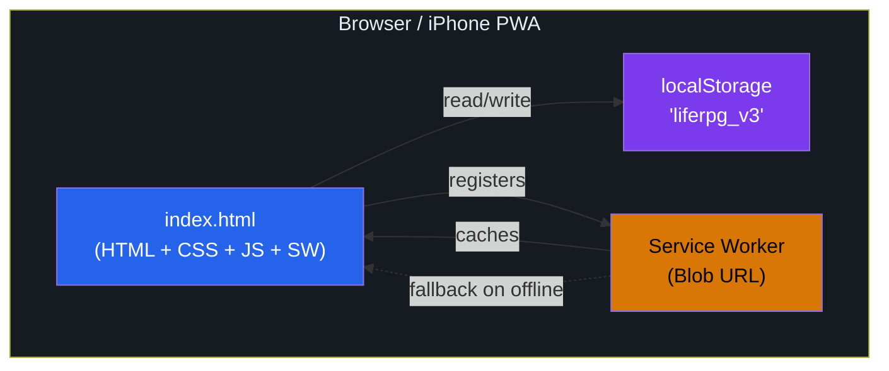
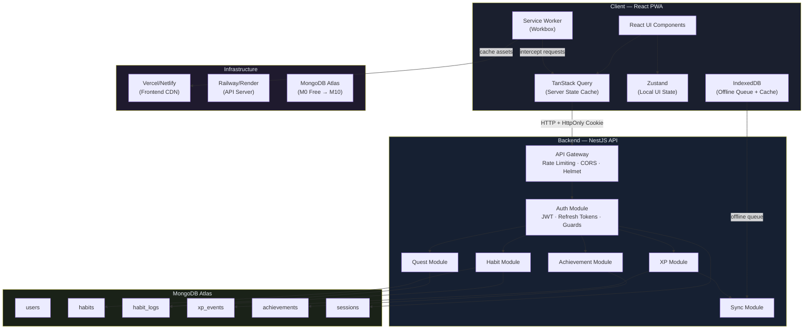
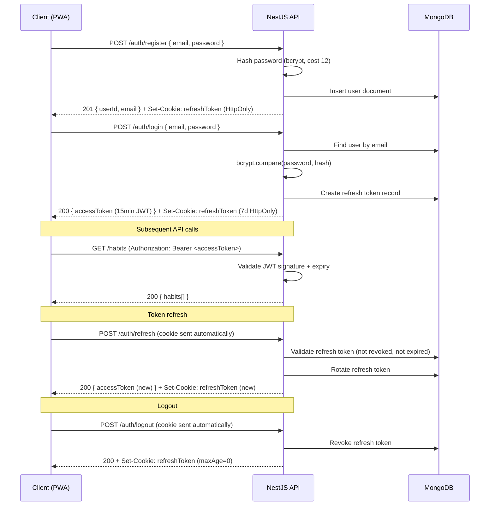
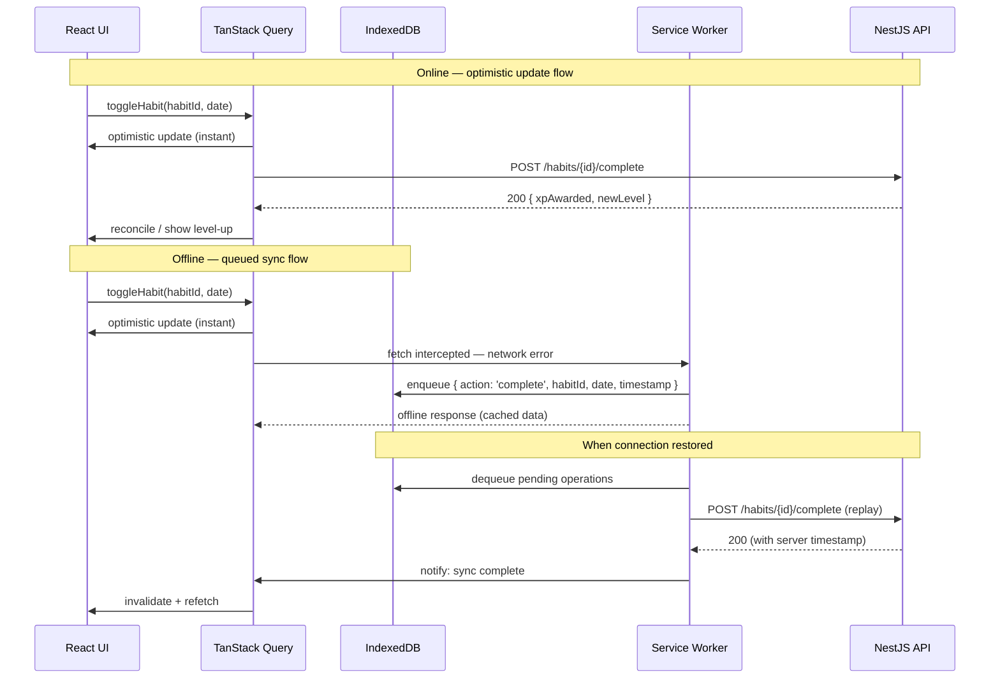
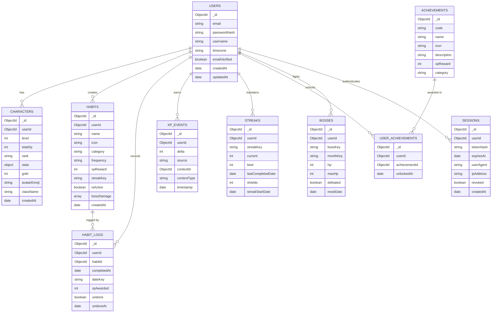

# Life RPG System — Enhancement Plan

**Document version:** 1.0  
**Date:** 2026-06-17  
**Author analysis based on:** `index.html` (1 562 lines), `manifest.webmanifest`, `icon.svg`  
**Status:** Pre-implementation architecture review

---

## Table of Contents

1. [Current System Analysis](#1-current-system-analysis)
2. [Reverse-Engineered Domain Model](#2-reverse-engineered-domain-model)
3. [Stack Recommendation](#3-stack-recommendation)
4. [Target Architecture](#4-target-architecture)
5. [Database Design](#5-database-design)
6. [API Design](#6-api-design)
7. [Security Plan](#7-security-plan)
8. [PWA and Offline Strategy](#8-pwa-and-offline-strategy)
9. [Frontend Refactoring Plan](#9-frontend-refactoring-plan)
10. [Backend Implementation Plan](#10-backend-implementation-plan)
11. [Migration Plan](#11-migration-plan)
12. [Development Roadmap](#12-development-roadmap)
13. [Questions and Assumptions](#13-questions-and-assumptions)

---

## 1. Current System Analysis

### 1.1 What the App Does

Life RPG is a **gamified personal productivity tracker** built specifically for a software engineer's daily routine. It turns real-world habits and tasks into an RPG character-progression system. You complete daily and weekly "quests" (gym sessions, LeetCode problems, reading, job applications, etc.) and your character gains XP, levels up, earns stat boosts, and progresses through ranks. Neglecting quests applies XP penalties and debuffs. Monthly "boss battles" are defeated through consistent activity accumulation. Skill trees unlock informational nodes (resources and descriptions) at specific character levels.

### 1.2 Main Features and User Flows

| Feature | Description |
|---|---|
| **Daily Quests** | 10 hardcoded tasks; toggle-to-complete; reset at midnight |
| **Weekly Quests** | 5 quests; some auto-complete from daily counter; reset on Monday |
| **Character** | Level, XP, Gold, Rank, 6 Stats (STR/INT/WIS/DEX/CHA/END) |
| **Streaks** | 4 streaks (gym, code, reading, earlyRise); shields earned every 7 days |
| **Boss Battles** | 3 monthly bosses with HP; specific quests deal damage |
| **Skill Trees** | 3 trees × 6 nodes; unlocked by character level; informational only |
| **Achievements** | 15 hardcoded; auto-checked after every state mutation |
| **Calendar Heatmap** | 30-day activity grid; full/partial/missed classification |
| **Penalties** | XP deduction on login after 1, 3, or 7 days of inactivity |
| **Theme** | Dark/light toggle; persisted in state |
| **Export/Import/Reset** | Full JSON export; JSON file import; hard reset |

**Primary user flow:**
1. Open app → daily reset check runs → penalties applied → render
2. Switch to Quests tab → tap quest to complete → XP awarded → animations fire
3. Daily quests auto-feed weekly quest counters
4. At midnight, daily quests reset; weekly resets Monday; bosses reset monthly

### 1.3 Data Storage

**All data lives exclusively in `localStorage` under the key `liferpg_v3`.**

The stored object shape:
```
{
  char:    { level, xp, gold, rank, stats: {STR,INT,WIS,DEX,CHA,END} }
  daily:   { lastReset: "YYYY-MM-DD", done: { [questId]: true } }
  weekly:  { lastReset: "YYYY-MM-DD", done: { [questId]: true }, track: {gymW,lcW,jobsW,bookW} }
  streaks: { gym, code, reading, earlyRise } × { n, last, shields }
  calendar:{ [YYYY-MM-DD]: { done: N, total: 10 } }
  bosses:  { interview, body, knowledge } × { name, icon, desc, hp, maxHp }
  bossMonth: "YYYY-MM"
  skills:  {} (always empty — skills are purely informational, never stored)
  ach:     { [achId]: "YYYY-MM-DD" }
  penalty: { debuffExp, mult, penaltyDate }
  meta:    { totalDone, gymT, lcT, readT, jobsT, bossKills, shieldsUsed, perfWeeks, lastActive }
  theme:   "dark" | "light"
}
```

No IndexedDB, no sessionStorage, no in-memory-only state beyond the single `S` variable.

### 1.4 File Structure and Responsibilities

```
index.html          — Everything: HTML structure, all CSS (~500 lines),
                      all JavaScript (~880 lines), service worker via blob,
                      app constants, state machine, rendering engine
icon.svg            — App icon (192×192 SVG)
manifest.webmanifest— PWA manifest
deploy.md           — Missing (file not found on disk)
```

There is no `icon-192.png` or `icon-512.png` on disk, yet the manifest references them. The PWA install will likely use a broken icon on Android (though the SVG fallback exists).

### 1.5 Current UI Structure

5-tab single-page app with a fixed bottom navigation bar:

| Tab | ID | Content |
|---|---|---|
| Hero | `tab-character` | Avatar, level, XP bar, rank badge, stats, metrics, data management |
| Quests | `tab-quests` | Daily quest list + progress bar, weekly quest list, reset countdown |
| Progress | `tab-progress` | 30-day heatmap, streak tracker, boss battle HP bars |
| Skills | `tab-skills` | 3 skill trees with locked/unlocked nodes |
| Achievements | `tab-achievements` | 15 achievement cards, locked/unlocked styling |

Max-width 430px, centered, mobile-first. Uses CSS custom properties as design tokens. Safe-area insets handled for iPhone notch/home indicator.

### 1.6 Current PWA Setup

**Service Worker:** Registered via a **Blob URL trick** — the SW code is embedded as a template string, converted to a Blob, and registered. This is a clever workaround for running a SW from a single HTML file (no separate `sw.js` needed), but it has critical problems (see §1.8).

**Manifest:** References `icon-192.png` and `icon-512.png` which don't exist. Only `icon.svg` exists. The `screenshots` array is empty. `purpose: "any maskable"` is set on the SVG, but SVG maskable icons are not well-supported.

**Cache strategy:** Cache-first for GET requests; falls back to `index.html` (root `.`) on network failure. Cache key is `liferpg-v2`. On install, only `'.'` (the root document) is pre-cached.

### 1.7 Current Deployment Approach

Unknown — `deploy.md` was missing from disk. Based on the code structure (single HTML file, no build step, no `package.json`), this is almost certainly deployed via static file hosting (Netlify, GitHub Pages, or Vercel drag-and-drop). The app requires no server-side processing.

### 1.8 Current Limitations

1. **Single-device only.** All data is localStorage — no sync, no cloud backup, no multi-device support.
2. **No user account.** No concept of identity; you cannot log in from another device.
3. **Hardcoded quests.** You cannot add, edit, or delete quests. All 10 daily and 5 weekly quests are `const` arrays in JavaScript.
4. **No real reminders.** No push notifications; no scheduled reminders for incomplete daily quests.
5. **Broken icons.** manifest references PNG icons that don't exist. iOS PWA add-to-home-screen may show a generic icon.
6. **Blob SW incompatibility.** The Blob URL service worker trick breaks on Safari/iOS in some versions and violates the service worker spec (`scope` cannot be broader than the script URL). The SW may silently fail to register.
7. **Midnight reset is app-open-triggered only.** If you open the app two days after the last open, two days of penalties fire at once, but only for the cumulative gap — not each individual day.
8. **No timezone handling.** `today()` uses `new Date().toISOString().split('T')[0]` which is UTC. If you're not in UTC+0, a day might reset at 8 AM or 2 PM local time instead of midnight.
9. **Calendar grows unbounded.** `S.calendar` stores every day ever. After years of use, localStorage may approach its 5–10 MB limit.
10. **No data validation on import.** Any JSON file can be imported and merged. Malicious or corrupt data can break the app state.

### 1.9 Technical Debt

- **God file.** The 1 562-line `index.html` is impossible to maintain at scale. Every feature is tangled together: CSS, HTML, constants, state, rendering, business logic.
- **Global variable `S`.** State is a single mutable global. Any function can mutate any part of it. No encapsulation, no immutability, no change tracking.
- **`innerHTML` everywhere.** All rendering uses string concatenation and `innerHTML` assignment, which is both unsafe (XSS) and a maintenance nightmare.
- **No tests.** Zero test coverage. XP calculation, streak logic, penalty logic — all untested.
- **Hardcoded personal data.** Character name "The Architect", class "Software Engineer — Full-Stack", quest names and targets are personal specifics baked into constants. Another user cannot customize anything.
- **`Math.random()` in confetti loop.** Fine for animation, but random usage in business logic elsewhere would be untestable.
- **No error boundaries.** If `JSON.parse` throws on localStorage data, the catch silently creates a fresh state. The user loses all data with no warning.
- **`mod-body` uses `textContent`** for the body but `innerHTML` for `mod-extra` — inconsistent and easy to accidentally inject markup.

### 1.10 Security Weaknesses

| Weakness | Location | Risk |
|---|---|---|
| `innerHTML` with user-controlled data paths | `renderChar`, `renderQuests`, `renderSkills`, `renderAch` | XSS via imported JSON (quest names, achievement names) |
| No validation on JSON import | `importData()` — `merge(mkDefault(), JSON.parse(...))` | Malformed data can set `char.level` to `Infinity`, `xp` to negative, etc. |
| Blob URL service worker | SW registration code | SW may have unintended scope; `caches.add('.')` with a network error silently fails install |
| No CSP header | No HTTP headers possible from static hosting | XSS exploitation easier if script injection occurs |
| localStorage is not encrypted | Browser storage | On a shared device, any person/extension can read/write the user's RPG data |
| No CSRF / auth tokens | N/A (no backend) | Not applicable now, but must be designed correctly for the backend |
| Apple touch icon is a data URI | `<link rel="apple-touch-icon">` | 1KB inline SVG — not a security risk but unusual; iOS may ignore it |

### 1.11 Hidden Assumptions

1. **Single timezone.** The app assumes local device time == UTC (or that the user is always on the same device in the same timezone).
2. **One user per device.** No concept of profiles; localStorage key is global to the domain.
3. **Daily reset = "I open the app in the morning."** If the app is never opened, resets and penalties never fire.
4. **`skills` object is never used.** `S.skills` is initialized as `{}` but never read or written. Skill tree interaction only shows a modal; no skill state is persisted.
5. **Perfect Week = 7 consecutive perfect days.** The `perfDayStreak` counter in `checkPerfDay()` resets to 0 after 7 — but there's no check that those 7 days are *consecutive calendar days*. If you complete all quests 7 non-consecutive days, the counter still increments.
6. **Weekly quest manual toggle.** `w_mock` (Mock Interview) has no `trackKey`, so it must be manually toggled — it cannot auto-complete.
7. **Boss HP damage values are magic numbers.** `hitBoss('body', 50)` — where does 50 come from? No documentation. Not configurable.
8. **`boostStats()` is deterministic but appears random.** Stat boosts at non-milestone levels use `level % numStats` as an array index — always the same stat for a given level, but looks arbitrary to the user.

---

## 2. Reverse-Engineered Domain Model

### 2.1 Core Domain Concepts

#### User / Character

| Aspect | Current state | Current fields | Should have |
|---|---|---|---|
| **Meaning** | The player's RPG identity. One per device. | `level`, `xp`, `gold`, `rank`, `stats{}` | + `userId`, `username`, `email`, `avatarUrl`, `class`, `bio`, `timezone`, `createdAt` |
| **Code location** | `S.char`, `mkDefault()`, `renderChar()` | As above | — |
| **In DB?** | No — localStorage | — | Yes, `users` + `characters` collection |
| **User-specific?** | Yes (implicitly single-user) | — | Yes |

#### Habit / Daily Quest

| Aspect | Current state | Should have |
|---|---|---|
| **Meaning** | A daily repeatable task that awards XP and contributes to streaks | — |
| **Code location** | `DAILY_Q` const array, `toggleDaily()`, `S.daily.done` | — |
| **Current fields** | `id`, `name`, `xp`, `icon`, `streak` (optional link) | + `userId`, `frequency` (daily/weekly/custom), `difficulty`, `category`, `isActive`, `targetCount`, `notes`, `createdAt`, `updatedAt` |
| **Should be in DB** | No — hardcoded | Yes — user-created habits |
| **User-specific** | No — same for all (but should be) | Yes |

**Critical gap:** Quests are hardcoded. A real system must allow users to create their own habits.

#### Habit Log / Completion Event

| Aspect | Current state | Should have |
|---|---|---|
| **Meaning** | Record that a habit was completed on a given day | — |
| **Code location** | `S.daily.done[id]: true`, `S.calendar[date]` | — |
| **Current fields** | Boolean flag per quest per day | `userId`, `habitId`, `completedAt` (timestamp), `xpAwarded`, `note`, `undoneAt` |
| **Should be in DB** | No | Yes — event log for analytics, audit, undo |

#### XP / Experience Points

| Aspect | Current | Should have |
|---|---|---|
| **Meaning** | Progress currency; drives leveling | — |
| **Calculation** | `level * 500` XP per level. XP stored as *current XP in level*, not total XP. `totalXP()` derives total from level + current. | Store total XP in `xp_events` and calculate derived current-level XP |
| **Code location** | `rawAddXP()`, `addXP()`, `xpNeeded()`, `totalXP()` | — |
| **Current fields** | `S.char.xp` (within-level XP), `S.char.level` | `userId`, `source` (habit/achievement/boss/penalty), `delta`, `timestamp`, `contextId`, `contextType` |
| **Should be in DB** | No | Yes — full event log |

**Design decision needed:** XP should be derived from the event log (sum of all `xp_events.delta`), not stored as a mutable number. This prevents cheating, enables audit, enables undo.

#### Level and Rank

| Aspect | Current | Should have |
|---|---|---|
| **Meaning** | Character progression milestones | — |
| **Current ranks** | Bronze (0), Iron (5), Silver (10), Gold (20), Platinum (35), Diamond (50), Legendary (75) | Same, but configurable |
| **Code location** | `RANKS` const, `refreshRank()`, `rankOf()` | — |
| **Should be in DB** | No — derived from level | Level stored; rank derived |

#### Streak

| Aspect | Current | Should have |
|---|---|---|
| **Meaning** | Consecutive-day count for a habit category | — |
| **Types** | gym, code, reading, earlyRise | Per-habit streaks (not just categories) |
| **Current fields** | `n` (count), `last` (date string), `shields` (count) | + `userId`, `habitId`, `bestStreak`, `currentStreakStartDate` |
| **Code location** | `S.streaks{}`, `updateStreak()`, `useShield()` | — |
| **Should be in DB** | No | Yes — derived from habit_logs but cached for performance |

#### Quest (Weekly / Boss)

| Aspect | Current | Should have |
|---|---|---|
| **Weekly Meaning** | Multi-day target (e.g. "3 gym sessions this week") | — |
| **Boss Meaning** | Monthly accumulation challenge; dealing damage = completing related quests | — |
| **Current fields** | `id`, `name`, `xp`, `icon`, `trackKey`, `target` (weekly); `name`, `icon`, `desc`, `hp`, `maxHp` (boss) | + `userId`, `type`, `period`, `status`, `progress`, `startDate`, `endDate` |
| **Should be in DB** | No | Yes |

#### Achievement

| Aspect | Current | Should have |
|---|---|---|
| **Meaning** | One-time milestone unlocked when a condition is met | — |
| **Current fields** | `id`, `name`, `icon`, `desc`, `xp`, `check` (function) | + `category`, `rarity`, `isSecret`, `unlockedAt` |
| **Code location** | `ACHIEVEMENTS` const, `checkAch()`, `S.ach{}` | — |
| **In DB?** | Achievement definitions — no. User unlocks — yes (`S.ach`) | Definitions in code or seed data; user unlocks in DB |

#### Stat

| Aspect | Current | Should have |
|---|---|---|
| **Types** | STR, INT, WIS, DEX, CHA, END | Same, extensible |
| **Meaning** | Character attributes. Currently cosmetic — they display bars but don't affect any game mechanics. | Should influence XP multipliers or available abilities |
| **Increment rule** | +1 to stat `level % 6` on each level-up; +2 all stats on level % 5 | Same |

#### Penalty / Debuff

| Aspect | Current | Should have |
|---|---|---|
| **Meaning** | Negative consequence for inactivity | — |
| **Logic** | 1+ days: -25 XP (no gym) + -20 XP (no code); 3+ days: -100 XP; 7+ days: -500 XP + 10% debuff for 3 days | Same, configurable |
| **Code location** | `applyPenalties()`, `S.penalty` | — |
| **Bug** | `penaltyDate` check prevents double-apply on same day but doesn't handle a scenario where `lastActive` is null and gap is negative | Fix with server-side authoritative timestamps |

#### Meta / Counters

| Aspect | Current | Should have |
|---|---|---|
| **Purpose** | Accumulation counters used by achievement checks | — |
| **Fields** | `totalDone`, `gymT`, `lcT`, `readT`, `jobsT`, `bossKills`, `shieldsUsed`, `perfWeeks`, `lastActive`, `perfDayStreak` | All derived from event log in a real system; stored as materialized views / cached aggregates |

#### Settings

| Aspect | Current | Should have |
|---|---|---|
| **Current** | Only `theme` (dark/light) stored in `S.theme` | Timezone, notification preferences, daily reset time, display preferences |

---

## 3. Stack Recommendation

### 3.1 Option A — React + Vite + Express/NestJS + MongoDB

**Frontend:** React 19 + TypeScript + Vite + Tailwind CSS + PWA plugin  
**Backend:** Node.js + NestJS (or Express)  
**Database:** MongoDB + Mongoose  
**Auth:** JWT + refresh tokens (cookie-based)

| Dimension | Assessment |
|---|---|
| **Pros** | Complete control; natural SPA → PWA path; JavaScript end-to-end (shared types); MongoDB flexible schema fits RPG data well; NestJS has excellent structure for a solo learner |
| **Cons** | Requires running and deploying two separate services (frontend + backend); more DevOps complexity |
| **Learning value** | High — React, TypeScript, REST API design, MongoDB, NestJS all directly employable |
| **Complexity** | Medium-high setup; medium ongoing |
| **Security maturity** | Good if done correctly; NestJS has Guards, Pipes, Interceptors |
| **Scalability** | Excellent — can scale horizontally |
| **Solo learning project** | Ideal |
| **Production-style growth** | Very good — close to what most companies use |

### 3.2 Option B — Next.js Full-Stack + MongoDB

**Frontend:** Next.js 15 (App Router) + TypeScript + Tailwind CSS  
**Backend:** Next.js API Routes or Server Actions  
**Database:** MongoDB  
**Auth:** NextAuth.js v5 / Auth.js  
**PWA:** `next-pwa` or `@ducanh2912/next-pwa`

| Dimension | Assessment |
|---|---|
| **Pros** | Single repo (monolith); simpler deployment (Vercel one-click); Server Components reduce frontend JS; excellent DX |
| **Cons** | PWA support in Next.js App Router is incomplete and actively changing; `next-pwa` is community-maintained with gaps; server actions blur the line between frontend and backend (harder to test in isolation); Vercel free tier has limits |
| **Learning value** | High for Next.js specifically; less separation of concerns than a proper frontend/backend split |
| **Complexity** | Lower initial setup; but App Router complexity grows |
| **Security maturity** | Good; NextAuth.js handles most auth flows |
| **Scalability** | Good (Vercel edge), but harder to self-host |
| **Solo learning project** | Great for speed; less ideal if goal is to learn proper API design |
| **Production-style growth** | Excellent for SaaS products |

### 3.3 Option C — React PWA + Java Spring Boot + MongoDB/PostgreSQL

**Frontend:** React + TypeScript + Vite  
**Backend:** Java 21 + Spring Boot 3.x + Spring Security  
**Database:** MongoDB or PostgreSQL  
**Auth:** Spring Security + JWT

| Dimension | Assessment |
|---|---|
| **Pros** | Directly useful given your Spring Boot experience; production-grade security out of the box; excellent for learning enterprise patterns |
| **Cons** | JavaScript frontend + Java backend = context switching between two languages and two build systems; heavier JVM overhead for a small personal app; slower iteration |
| **Learning value** | Very high for Spring Boot/Security — directly applicable to your career |
| **Complexity** | High — two completely different languages, two build systems, two deployment artifacts |
| **Security maturity** | Highest — Spring Security is battle-tested |
| **Scalability** | Enterprise-grade |
| **Solo learning project** | Good but slow to iterate |
| **Production-style growth** | Excellent for enterprise; over-engineered for a personal PWA |

### 3.4 Final Recommendation: **Option A with NestJS**

**Stack:**
- **Frontend:** React 19 + TypeScript + Vite + `vite-plugin-pwa` (Workbox) + TanStack Query + Zustand
- **Backend:** NestJS + TypeScript + Mongoose
- **Database:** MongoDB Atlas (free tier initially)
- **Auth:** JWT access tokens (15 min) + refresh tokens (7 days) in `HttpOnly` cookies
- **Deployment:** Frontend → Vercel/Netlify; Backend → Railway/Render (free tier)

**Why this stack:**

1. **JavaScript end-to-end.** Shared TypeScript types between frontend and backend. Define `IHabit` once, use it everywhere. No context switching.

2. **MongoDB is the right fit for this domain.** RPG data is naturally document-shaped. A habit document naturally embeds its metadata. An XP event log is a natural append-only collection. MongoDB's flexible schema also means you can evolve the data model without painful migrations during learning.

3. **NestJS teaches enterprise patterns without the Java overhead.** Modules, Controllers, Services, Guards, Pipes, Interceptors — these map 1:1 to Spring Boot concepts you already know. It will reinforce your understanding of layered architecture and make you more effective in your Java work too.

4. **Vite PWA plugin (Workbox) is the gold standard** for React PWAs. The blob URL service worker trick in the current app must be replaced.

5. **TanStack Query** gives you offline-aware server state management with caching, stale-while-revalidate, background sync — perfect for a PWA.

6. **Zustand** is lightweight local state management — no Redux boilerplate for a solo project.

**However:** If your primary goal is deepening Spring Boot knowledge, choose Option C. The learning value from wiring Spring Security properly is exceptional and directly career-applicable.

---

## 4. Target Architecture

### 4.1 Current Architecture



### 4.2 Proposed Architecture



### 4.3 Authentication Flow



### 4.4 Data Sync Flow



### 4.5 Entity Relationship Diagram



### 4.6 Deployment Architecture

```
┌─────────────────────────────────────────────────────────────────────┐
│  Vercel / Netlify (Frontend CDN)                                    │
│  ┌─────────────────┐  ┌──────────────────────────────────────────┐ │
│  │ React PWA Bundle │  │ service-worker.js + workbox assets       │ │
│  │ (static files)   │  │ manifest.webmanifest + icons             │ │
│  └─────────────────┘  └──────────────────────────────────────────┘ │
│  Global CDN edge distribution                                       │
└────────────────────────────┬────────────────────────────────────────┘
                             │ HTTPS API calls
┌────────────────────────────▼────────────────────────────────────────┐
│  Railway / Render (API Server)                                      │
│  ┌──────────────────────────────────────────────────────────────┐  │
│  │ NestJS App (Node.js 20 LTS)                                   │  │
│  │  PORT 3001   CORS: [liferpg.app]   Helmet headers            │  │
│  │  Rate limiting: 100 req/15min (auth), 500 req/15min (api)    │  │
│  └─────────────────────────┬────────────────────────────────────┘  │
└────────────────────────────┼────────────────────────────────────────┘
                             │ MongoDB driver (TLS)
┌────────────────────────────▼────────────────────────────────────────┐
│  MongoDB Atlas M0 → M10                                             │
│  Cluster: liferpg-cluster-0                                         │
│  Region: closest to API server (same cloud provider ideally)        │
│  Backup: Daily snapshots (Atlas built-in on M10+)                  │
└─────────────────────────────────────────────────────────────────────┘
```

### 4.7 Environment Configuration

```
# Backend .env (never committed)
NODE_ENV=production
PORT=3001
MONGODB_URI=mongodb+srv://...
JWT_SECRET=<256-bit random>
JWT_EXPIRY=15m
REFRESH_TOKEN_SECRET=<256-bit random>
REFRESH_TOKEN_EXPIRY=7d
COOKIE_DOMAIN=liferpg.app
FRONTEND_URL=https://liferpg.app
BCRYPT_ROUNDS=12

# Frontend .env (safe to expose — no secrets)
VITE_API_URL=https://api.liferpg.app
VITE_APP_NAME=Life RPG
```

---

## 5. Database Design

### 5.1 MongoDB Design Philosophy

This app's data is predominantly **user-owned, user-isolated** (each document belongs to one user). The key design tensions:

- **Embedding vs referencing:** Habit metadata (name, icon, xp) should be referenced from `habit_logs`, not embedded — the habit name may change.
- **Event sourcing for XP:** Store every XP change in `xp_events`. Derive character level and current XP from this log. This prevents data corruption and enables undo.
- **Materialized streak cache:** Streaks are expensive to recalculate from scratch on every request. Store current streak in a `streaks` collection and update it incrementally.

### 5.2 Collection: `users`

**Purpose:** Authentication identity and account management.

```js
{
  _id: ObjectId,
  email: "yomal@example.com",       // required, unique, lowercase, trimmed
  passwordHash: "$2b$12$...",        // bcrypt, never returned to client
  username: "TheArchitect",          // required, unique, 3–30 chars
  timezone: "Asia/Colombo",          // IANA timezone string, default "UTC"
  emailVerified: false,              // boolean
  emailVerifyToken: null,            // string | null
  emailVerifyExpires: null,          // Date | null
  passwordResetToken: null,          // bcrypt hash of token, not plain token
  passwordResetExpires: null,        // Date | null
  failedLoginAttempts: 0,            // int, reset on success
  lockUntil: null,                   // Date | null (account lockout)
  createdAt: ISODate("2026-06-17"),
  updatedAt: ISODate("2026-06-17"),
}
```

**Indexes:**
- `{ email: 1 }` — unique
- `{ username: 1 }` — unique
- `{ passwordResetToken: 1 }` — sparse (only when set)

**Validation:** Email format, password min 8 chars (validated before hashing), username alphanum+underscore.

**Notes:** Never return `passwordHash`, `passwordResetToken`, `emailVerifyToken` to the client. Projection is enforced at the service layer.

### 5.3 Collection: `characters`

**Purpose:** RPG character state for a user. One character per user initially.

```js
{
  _id: ObjectId,
  userId: ObjectId,                  // ref: users._id
  level: 1,                          // int >= 1
  totalXp: 0,                        // int >= 0; derived from sum(xp_events.delta) but cached here
  currentLevelXp: 0,                 // int; XP within current level
  xpToNextLevel: 500,                // int; = level * 500
  gold: 0,                           // int >= 0
  rank: "Bronze",                    // derived, cached
  stats: {
    STR: 10, INT: 10, WIS: 10,
    DEX: 10, CHA: 10, END: 10
  },
  avatarEmoji: "⚔️",
  className: "Software Engineer — Full-Stack",
  penaltyMultiplier: 1.0,            // 0.0 – 1.0; XP modifier from debuffs
  penaltyExpiresAt: null,            // Date | null
  createdAt: ISODate,
  updatedAt: ISODate,
}
```

**Indexes:**
- `{ userId: 1 }` — unique

**Notes:** `totalXp`, `rank`, `currentLevelXp` are materialized/cached fields. The canonical source of truth is `xp_events`. Periodically recalculate from events to ensure consistency (nightly job or on-demand reconcile endpoint).

### 5.4 Collection: `habits`

**Purpose:** User-defined habits/tasks. Replaces the hardcoded `DAILY_Q` and `WEEKLY_Q` constants.

```js
{
  _id: ObjectId,
  userId: ObjectId,
  name: "Gym Session",               // required, 1–100 chars
  icon: "🏋️",                        // emoji, 1–4 chars
  category: "fitness",               // fitness|coding|reading|career|wellness|custom
  frequency: "daily",                // daily|weekly
  xpReward: 50,                      // int 1–1000
  difficulty: "medium",              // easy|medium|hard|legendary
  streakKey: "gym",                  // string | null; links to streaks collection
  bossDamage: [                      // optional; which bosses this habit damages
    { bossKey: "body", damage: 50 }
  ],
  weeklyTarget: null,                // int | null; for weekly accumulation quests
  weeklyTrackKey: null,              // string | null; e.g. "gymW"
  isActive: true,
  sortOrder: 0,                      // int; user-defined display order
  notes: "",
  createdAt: ISODate,
  updatedAt: ISODate,
}
```

**Indexes:**
- `{ userId: 1, isActive: 1, frequency: 1 }` — compound; most common query
- `{ userId: 1, category: 1 }`

**Validation:** `xpReward` in [1, 1000]; `frequency` in enum; `category` in enum.

**Migration note:** On first backend integration, seed the default 10 daily quests and 5 weekly quests from the hardcoded constants as user habits.

### 5.5 Collection: `habit_logs`

**Purpose:** Immutable record of every habit completion (and undo). This is the event log.

```js
{
  _id: ObjectId,
  userId: ObjectId,
  habitId: ObjectId,
  dateKey: "2026-06-17",             // YYYY-MM-DD in user's timezone; idempotency key
  completedAt: ISODate,              // UTC timestamp
  xpAwarded: 50,                     // int; actual XP (after multiplier)
  undone: false,                     // boolean
  undoneAt: null,                    // Date | null
  source: "manual",                  // manual|auto (for auto-completed weeklies)
  syncId: "uuid-v4",                 // client-generated idempotency key for offline sync
}
```

**Indexes:**
- `{ userId: 1, dateKey: 1 }` — daily activity queries
- `{ userId: 1, habitId: 1, dateKey: 1 }` — unique (sparse on undone=false); prevents duplicate completions
- `{ syncId: 1 }` — unique sparse; idempotency for offline sync replay

**Key design decision:** The combination of `(userId, habitId, dateKey, undone: false)` must be unique. Enforced via MongoDB partial unique index:
```js
db.habit_logs.createIndex(
  { userId: 1, habitId: 1, dateKey: 1 },
  { unique: true, partialFilterExpression: { undone: false } }
)
```

**Timezone handling:** The API server converts the client's reported local date to a `dateKey` using the user's stored `timezone` field (via `Intl.DateTimeFormat` or `date-fns-tz`). The server never trusts a client-supplied `dateKey` directly — it derives it from the UTC `completedAt` timestamp and the user's timezone.

### 5.6 Collection: `xp_events`

**Purpose:** Immutable XP event log. Every XP change (positive or negative) is recorded here.

```js
{
  _id: ObjectId,
  userId: ObjectId,
  delta: 50,                         // int, positive or negative
  source: "habit_complete",          // habit_complete|habit_undo|achievement|boss_kill|
                                     // penalty_inactive|penalty_missed|level_up_bonus|shield_earn
  contextId: ObjectId,               // ref to habit_logs._id, achievements._id, etc.
  contextType: "habit_log",          // collection name of contextId
  multiplierApplied: 1.0,            // penalty multiplier at time of event
  balanceBefore: 4950,               // totalXp before this event (for audit)
  balanceAfter: 5000,                // totalXp after this event
  timestamp: ISODate,
}
```

**Indexes:**
- `{ userId: 1, timestamp: -1 }` — user XP history, most recent first
- `{ userId: 1, source: 1 }` — analytics by source

**Notes:** This log is append-only. Never update or delete. To "undo" a habit completion, insert a new negative-delta event with `source: "habit_undo"`. The character's `totalXp` is the sum of all events; recalculate if the cached value drifts.

### 5.7 Collection: `streaks`

**Purpose:** Cached current streak state per habit category per user.

```js
{
  _id: ObjectId,
  userId: ObjectId,
  streakKey: "gym",                  // matches habit.streakKey values
  current: 7,                        // current consecutive days
  best: 14,                          // all-time best
  lastCompletedDateKey: "2026-06-17",// YYYY-MM-DD in user's timezone
  streakStartDateKey: "2026-06-11",
  shields: 1,                        // available streak shields, max 3
  totalShieldsEarned: 2,
  totalShieldsUsed: 1,
  updatedAt: ISODate,
}
```

**Indexes:**
- `{ userId: 1, streakKey: 1 }` — unique

**Streak calculation logic (server-side):**
```
function updateStreak(streak, todayKey, userTimezone):
  yesterday = getPreviousDayKey(todayKey, userTimezone)
  
  if streak.lastCompletedDateKey == todayKey:
    return  // already counted today
  
  if streak.lastCompletedDateKey == yesterday:
    streak.current++  // consecutive day
  
  elif daysBetween(streak.lastCompletedDateKey, todayKey) == 2 AND streak.shields > 0:
    streak.shields--  // shield saves streak
    streak.current++
  
  else:
    streak.current = 1  // broken — restart
    streak.streakStartDateKey = todayKey
  
  if streak.current > streak.best:
    streak.best = streak.current
  
  if streak.current % 7 == 0:
    streak.shields = min(streak.shields + 1, 3)
  
  streak.lastCompletedDateKey = todayKey
```

### 5.8 Collection: `achievements`

**Purpose:** Master list of achievement definitions. Seeded from code; not user-editable.

```js
{
  _id: ObjectId,
  code: "first_q",                   // unique string identifier
  name: "First Blood",
  icon: "⚔️",
  description: "Complete your first quest",
  xpReward: 50,
  category: "general",              // general|fitness|coding|career|milestones
  rarity: "common",                 // common|rare|epic|legendary
  isSecret: false,
  condition: {                       // structured condition (not a function)
    type: "totalDone_gte",
    threshold: 1
  },
}
```

**Notes:** Achievement `check` functions from the current code should be converted to structured `condition` objects evaluated server-side. This prevents XSS (passing functions from the client) and enables server-side validation.

### 5.9 Collection: `user_achievements`

**Purpose:** Record of achievements unlocked by each user.

```js
{
  _id: ObjectId,
  userId: ObjectId,
  achievementId: ObjectId,
  unlockedAt: ISODate,
  xpAwarded: 50,                     // XP given when unlocked (snapshot)
}
```

**Indexes:**
- `{ userId: 1, achievementId: 1 }` — unique

### 5.10 Collection: `bosses`

**Purpose:** Monthly boss battle state per user.

```js
{
  _id: ObjectId,
  userId: ObjectId,
  bossKey: "interview",              // interview|body|knowledge
  monthKey: "2026-06",              // YYYY-MM
  name: "Interview Gauntlet",
  icon: "🎤",
  description: "Complete mock interviews & LeetCodes this month",
  hp: 760,                           // current HP
  maxHp: 1000,
  defeated: false,
  defeatXpAwarded: false,            // prevent double XP on boss kill
}
```

**Indexes:**
- `{ userId: 1, bossKey: 1, monthKey: 1 }` — unique

**Notes:** On new month, the backend creates 3 fresh boss documents for the user (or resets existing ones). This is triggered on first API call after month change, checked via `monthKey`.

### 5.11 Collection: `sessions` (Refresh Tokens)

**Purpose:** Persistent server-side session for refresh token rotation.

```js
{
  _id: ObjectId,
  userId: ObjectId,
  tokenHash: "sha256(refreshToken)",  // NEVER store plain refresh token
  family: "uuid-v4",                  // for refresh token family tracking (detect theft)
  expiresAt: ISODate,
  userAgent: "Mozilla/5.0...",
  ipAddress: "1.2.3.4",              // log for audit, not for authorization
  revoked: false,
  revokedAt: null,
  createdAt: ISODate,
}
```

**Indexes:**
- `{ tokenHash: 1 }` — unique
- `{ userId: 1, revoked: 1 }`
- `{ expiresAt: 1 }` — TTL index: `db.sessions.createIndex({ expiresAt: 1 }, { expireAfterSeconds: 0 })`

**Security:** Store only the SHA-256 hash of the refresh token. The plain token lives only in the `HttpOnly` cookie on the client. If the token database is compromised, tokens cannot be used without the hash preimage.

### 5.12 Collection: `settings`

**Purpose:** User preferences that affect behavior (not just appearance).

```js
{
  _id: ObjectId,
  userId: ObjectId,
  dailyResetHour: 0,                 // 0–23; hour in user's timezone for daily reset (default midnight)
  weekStartsOn: 1,                   // 0=Sun, 1=Mon
  theme: "dark",
  notificationsEnabled: false,
  pushSubscription: null,            // WebPush subscription object | null
  reminderTimes: ["09:00"],          // array of HH:MM strings in user's timezone
  language: "en",
  updatedAt: ISODate,
}
```

### 5.13 XP and Level Calculation

**Should XP be stored as total or derived?**

Store `totalXp` as a **cached materialized value** on `characters`, but maintain `xp_events` as the source of truth. This gives:
- Fast reads (no aggregation pipeline needed to render the character screen)
- Auditability (full event history)
- Correctness (recalculate on suspicion of drift: `SUM(xp_events.delta) WHERE userId = ?`)

**Level derivation from totalXp:**
```
Level 1: needs 0–499 XP (500 to level up)
Level 2: needs 500–1499 XP (1000 to level up)
Level 3: needs 1500–2999 XP (1500 to level up)
Level N: needs sum(500*i for i in 1..N-1) cumulative XP
XP to next level: level * 500
```

This means at level 10, you've accumulated 27,500 total XP. The function `xpForLevel(N)` = `N * 500`. Total XP for level N = `sum(i * 500 for i in 1..N-1)` = `500 * N * (N-1) / 2`.

**Preventing duplicate daily completions:**
- Partial unique index on `habit_logs`: `(userId, habitId, dateKey)` where `undone: false`
- Server always derives `dateKey` from `completedAt` UTC + user timezone (never trusts client `dateKey`)
- For offline sync replay: idempotency check via `syncId` unique index — return 200 if already processed

**Daily reset logic:**
- Server-side, triggered on first authenticated request of a new day
- Compare `dateKey` of last request with today's `dateKey` in user's timezone
- Run penalty calculations with authoritative server timestamps
- No client-side reset logic needed

### 5.14 Analytics Support

The schema supports future analytics out of the box:
- `habit_logs` aggregated by `dateKey` → activity heatmap
- `habit_logs` grouped by `habitId`, `month(completedAt)` → per-habit monthly stats
- `xp_events` by `source` → XP breakdown charts
- `streaks.best` → all-time records
- `user_achievements.unlockedAt` → achievement unlock timeline

---

## 6. API Design

### 6.1 Base URL and Common Patterns

```
Base: https://api.liferpg.app/v1

Headers (all authenticated endpoints):
  Authorization: Bearer <accessToken>
  Content-Type: application/json

Common error response:
{
  "statusCode": 400,
  "message": "Validation failed",
  "errors": [{ "field": "email", "message": "Invalid email format" }],
  "timestamp": "2026-06-17T10:00:00Z",
  "path": "/v1/auth/register"
}
```

### 6.2 Authentication Endpoints

| Method | Path | Request | Response | Auth | Notes |
|---|---|---|---|---|---|
| `POST` | `/auth/register` | `{ email, password, username, timezone }` | `201 { userId, email, username }` | None | Rate limit: 5/15min per IP |
| `POST` | `/auth/login` | `{ email, password }` | `200 { accessToken }` + cookie | None | Rate limit: 10/15min per IP |
| `POST` | `/auth/refresh` | cookie | `200 { accessToken }` + new cookie | Cookie | Rotates refresh token |
| `POST` | `/auth/logout` | cookie | `200 {}` + clear cookie | Cookie | Revokes refresh token |
| `POST` | `/auth/logout-all` | — | `200 {}` | Bearer | Revokes all sessions |
| `POST` | `/auth/forgot-password` | `{ email }` | `200 {}` | None | Always returns 200 (no user enumeration) |
| `POST` | `/auth/reset-password` | `{ token, newPassword }` | `200 {}` | None | Token expires 1 hour |
| `GET`  | `/auth/verify-email/:token` | — | `302 → /login` | None | — |

**Security notes:**
- `/auth/forgot-password` always returns `200` regardless of whether email exists (prevents user enumeration)
- Password reset token stored as bcrypt hash; plain token sent in email only
- Brute-force: after 5 failed logins, lock account for 15 minutes (exponential backoff)

### 6.3 User Profile Endpoints

| Method | Path | Request | Response | Auth | Notes |
|---|---|---|---|---|---|
| `GET`  | `/users/me` | — | `200 { userId, email, username, timezone, emailVerified }` | Bearer | Never returns passwordHash |
| `PATCH` | `/users/me` | `{ username?, timezone? }` | `200 { ...updated }` | Bearer | — |
| `DELETE` | `/users/me` | `{ password }` | `200 {}` | Bearer | Soft delete; cascade after 30 days |

### 6.4 Character Endpoints

| Method | Path | Request | Response | Auth |
|---|---|---|---|---|
| `GET`  | `/character` | — | `200 { level, totalXp, rank, stats, gold, ... }` | Bearer |
| `PATCH` | `/character` | `{ avatarEmoji?, className? }` | `200 { ...updated }` | Bearer |

### 6.5 Habits CRUD

| Method | Path | Request | Response | Auth | Notes |
|---|---|---|---|---|---|
| `GET`  | `/habits` | `?frequency=daily&active=true` | `200 { habits[] }` | Bearer | User sees only their habits |
| `POST` | `/habits` | `{ name, icon, category, frequency, xpReward, streakKey? }` | `201 { habit }` | Bearer | Max 50 habits per user |
| `GET`  | `/habits/:id` | — | `200 { habit }` | Bearer | 403 if not owner |
| `PATCH` | `/habits/:id` | `{ name?, icon?, xpReward?, isActive? }` | `200 { habit }` | Bearer | 403 if not owner |
| `DELETE` | `/habits/:id` | — | `204` | Bearer | Soft delete; logs remain |

**Authorization rule:** All habit operations check `habit.userId === req.user.userId`. Enforced in service layer, not just guard.

### 6.6 Habit Completion Endpoints

| Method | Path | Request | Response | Auth | Notes |
|---|---|---|---|---|---|
| `POST` | `/habits/:id/complete` | `{ syncId, completedAt? }` | `200 { xpAwarded, newTotalXp, newLevel?, streakUpdate, bossUpdates }` | Bearer | Idempotent via syncId |
| `POST` | `/habits/:id/undo` | `{ syncId, dateKey }` | `200 { xpReverted, newTotalXp }` | Bearer | Can only undo same-day completions |
| `GET`  | `/habits/:id/logs` | `?from=2026-06-01&to=2026-06-17` | `200 { logs[] }` | Bearer | Date range, user-filtered |

**Validation:** `completedAt` must be within 48 hours of server time (prevents backdating). `syncId` must be a valid UUID v4.

**Authorization:** `GET /habits/:id/logs` enforces `log.userId === req.user.userId` via query filter — never expose another user's logs.

### 6.7 Quests (Weekly Progress)

| Method | Path | Request | Response | Auth |
|---|---|---|---|---|
| `GET`  | `/quests/weekly` | — | `200 { weeklies: [{ quest, progress, completed }] }` | Bearer |
| `POST` | `/quests/weekly/:id/complete` | — | `200 { xpAwarded }` | Bearer |
| `POST` | `/quests/weekly/:id/undo` | — | `200 {}` | Bearer |

### 6.8 XP and Events

| Method | Path | Request | Response | Auth |
|---|---|---|---|---|
| `GET`  | `/xp/events` | `?limit=50&cursor=<objectId>` | `200 { events[], nextCursor }` | Bearer |
| `GET`  | `/xp/summary` | — | `200 { today, week, month, total, bySource }` | Bearer |

### 6.9 Achievements

| Method | Path | Request | Response | Auth |
|---|---|---|---|---|
| `GET`  | `/achievements` | — | `200 { all: [...], unlocked: [...] }` | Bearer |

### 6.10 Dashboard Summary

| Method | Path | Request | Response | Auth |
|---|---|---|---|---|
| `GET`  | `/dashboard` | — | `200 { character, todayHabits, weeklyQuests, activeStreaks, bosses, recentAchievements, xpToday }` | Bearer |

This is the primary endpoint called on app open. Aggregates all data needed for initial render in a single request. Reduces round trips on mobile.

### 6.11 Bosses

| Method | Path | Request | Response | Auth |
|---|---|---|---|---|
| `GET`  | `/bosses` | — | `200 { bosses[] }` | Bearer |

Boss HP is updated server-side when habits are completed. The `/habits/:id/complete` response includes `bossUpdates`.

### 6.12 Settings

| Method | Path | Request | Response | Auth |
|---|---|---|---|---|
| `GET`  | `/settings` | — | `200 { settings }` | Bearer |
| `PATCH` | `/settings` | `{ theme?, timezone?, dailyResetHour?, notificationsEnabled?, pushSubscription? }` | `200 { settings }` | Bearer |

### 6.13 Data Export / Import

| Method | Path | Request | Response | Auth | Notes |
|---|---|---|---|---|---|
| `GET`  | `/data/export` | — | `200 application/json` | Bearer | Full data dump; rate limited to 5/day |
| `POST` | `/data/import` | multipart/form-data or JSON body | `200 { summary }` | Bearer | Schema-validated; idempotent via habit names |
| `DELETE` | `/data/all` | `{ password }` | `200 {}` | Bearer | Hard reset; requires password confirmation |

---

## 7. Security Plan

### 7.1 Authentication

**Use:** JWT access tokens (15-minute expiry) + refresh tokens in `HttpOnly` cookies (7-day expiry).

**Why not pure JWT?** Long-lived JWTs cannot be revoked. If an access token is stolen, the attacker has 15 minutes. If a refresh token is stolen, the server-side revocation kicks in immediately.

**Why cookie for refresh token, not localStorage?**
- `HttpOnly` cookies cannot be read by JavaScript — XSS cannot steal them.
- `SameSite=Strict` prevents CSRF from third-party origins.
- localStorage is readable by any JavaScript on the page — if an XSS occurs, the attacker gets the refresh token.

**Token storage:**
```
Access token: JavaScript variable (in-memory only; not localStorage, not cookie)
  → Stored in TanStack Query cache or React context
  → Lost on page refresh (intentional — refresh token cookie auto-issues a new one)
  
Refresh token: HttpOnly, Secure, SameSite=Strict cookie
  → Path=/auth/refresh (only sent to refresh endpoint, not every API call)
  → Max-Age: 7 days
```

### 7.2 Password Security

- Hashing: **bcrypt** with cost factor 12 (recommended minimum for 2026)
- Minimum 8 characters; enforce complexity on the client (UX) but also on the server (security)
- No maximum password length (bcrypt safely handles long passwords via its 72-byte input limit — document this behavior)
- Password reset tokens: generate with `crypto.randomBytes(32)`, store SHA-256 hash in DB, expire in 1 hour
- Old password required to change password (prevents account takeover if session is stolen)

### 7.3 Session Management

- Refresh token rotation: each refresh issues a new refresh token and invalidates the old one
- **Refresh token family tracking:** If an already-used refresh token is presented (possible theft), revoke the entire family (all sessions for that user from that family)
- Session listing: `GET /auth/sessions` (future) — show active sessions, allow remote logout
- Auto-expire: MongoDB TTL index on `sessions.expiresAt` cleans up automatically

### 7.4 CSRF Protection

Since the refresh token is `SameSite=Strict`, no CSRF attack can trigger the `/auth/refresh` endpoint from a third-party site. The access token is sent as a `Bearer` header (not a cookie), so it cannot be sent by a browser's automatic cookie mechanism. **No additional CSRF token needed** with this design.

If you ever need to read the refresh token cookie from JavaScript (you shouldn't), you'd need CSRF tokens. Don't do it.

### 7.5 XSS Prevention

**Current vulnerability:** The app uses `innerHTML` with string concatenation. If any quest name or achievement name in localStorage contains `<script>`, it executes. In the new system:

- Use React's JSX rendering — React escapes all values by default. No `dangerouslySetInnerHTML`.
- Validate all string inputs server-side (Joi/Zod) — reject HTML characters in habit names, usernames.
- Set `Content-Security-Policy` header.
- Never render user-supplied content as HTML. Text content only.

### 7.6 Input Validation

All inputs validated at **two layers:**

1. **Frontend:** Zod schemas for form validation (UX feedback)
2. **Backend:** NestJS `ValidationPipe` with `class-validator` decorators (security enforcement)

The backend layer is the authority. Frontend validation is UX only.

```
Habit name: 1–100 chars, strip HTML tags, no special chars beyond emoji
XP reward: integer 1–1000
Emoji icon: max 4 chars (single emoji)
Email: RFC 5322 format
Password: 8–72 chars
Timezone: IANA timezone enum (validate against known list)
dateKey: YYYY-MM-DD format, within 48 hours of server time
```

### 7.7 Rate Limiting

| Endpoint Group | Limit | Window | Action on Exceed |
|---|---|---|---|
| `/auth/login` | 10 requests | 15 min per IP | 429 + exponential backoff |
| `/auth/register` | 5 requests | 15 min per IP | 429 |
| `/auth/forgot-password` | 3 requests | 1 hour per IP | 429 |
| `/data/export` | 5 requests | 24 hours per user | 429 |
| Global API | 500 requests | 15 min per user | 429 |

Use `@nestjs/throttler` or `express-rate-limit` with Redis store (for multi-instance environments). In-memory store is fine for a solo project.

### 7.8 Account Lockout

After 5 consecutive failed login attempts for an email:
- Lock the account for 15 minutes (exponential: 15, 30, 60 minutes)
- Increment `users.failedLoginAttempts` and set `users.lockUntil`
- Always return the same error message ("Invalid email or password") — no enumeration
- Reset counter on successful login

### 7.9 Authorization Model

This is a single-user-per-resource model. Every resource (habit, log, character) has a `userId` field. The authorization rule is simple: **you can only access your own data.**

Enforcement pattern:
```typescript
// Service layer — NOT just in the guard
const habit = await this.habitModel.findOne({ _id: id, userId: user.id });
if (!habit) throw new NotFoundException(); // 404, not 403 (no resource disclosure)
```

**Why 404 instead of 403?** Returning 403 when a user tries to access another user's resource confirms that the resource exists. Return 404 instead — the resource "doesn't exist" for this user.

### 7.10 Secure HTTP Headers (Helmet)

```typescript
// NestJS main.ts
app.use(helmet({
  contentSecurityPolicy: {
    directives: {
      defaultSrc: ["'self'"],
      scriptSrc: ["'self'"],
      styleSrc: ["'self'", "'unsafe-inline'"], // Tailwind inline styles
      imgSrc: ["'self'", "data:"],
      connectSrc: ["'self'", "https://api.liferpg.app"],
      fontSrc: ["'self'"],
      objectSrc: ["'none'"],
      upgradeInsecureRequests: [],
    },
  },
  hsts: { maxAge: 31536000, includeSubDomains: true },
  referrerPolicy: { policy: 'strict-origin-when-cross-origin' },
}));
```

### 7.11 CORS Policy

```typescript
app.enableCors({
  origin: ['https://liferpg.app', 'https://www.liferpg.app'],
  methods: ['GET', 'POST', 'PATCH', 'DELETE'],
  credentials: true, // required for cookies
  allowedHeaders: ['Content-Type', 'Authorization'],
});
```

Never use `origin: '*'` with `credentials: true` (browsers reject it anyway).

### 7.12 PWA-Specific Security Risks

**iOS PWA specifics:**
1. **`HttpOnly` cookie behavior on iOS Safari:** `HttpOnly` cookies work correctly in Safari and WKWebView. When installed as a PWA ("Add to Home Screen"), the app runs in a `WKWebView`-based standalone context. Cookies set from the API domain persist correctly — but test this on an actual device.
2. **No push notifications on iOS PWA (iOS < 16.4):** Before iOS 16.4, there is no Web Push API support in iOS PWAs. After 16.4, it requires explicit opt-in. Plan for this.
3. **Keychain vs localStorage:** On iOS, localStorage data for a PWA persists until the user clears Safari data — it is NOT encrypted by iOS Keychain. Do not store sensitive data in localStorage.
4. **Service worker scope on iOS:** iOS Safari has historically had incomplete SW support. Always test SW behavior on a physical iPhone.

**What must NOT be stored in localStorage (in the new system):**
- Access tokens — in-memory only
- Refresh tokens — `HttpOnly` cookie only
- Passwords or any credentials
- Personal information (email, full profile)

**What can safely be in localStorage/IndexedDB:**
- Cached API responses (non-sensitive — habit names, quest progress)
- Offline action queue (habit completions pending sync)
- UI preferences (theme, sort order)
- Character display data (level, XP — read-only cache; server is authoritative)

### 7.13 Secrets Management

```
Development: .env file (gitignored), dotenv
Production: Railway/Render environment variable UI, or HashiCorp Vault / AWS Parameter Store if scaling
Never: commit secrets to git, log secrets, put secrets in frontend code
```

### 7.14 Logging Without Leaking Sensitive Data

```typescript
// Bad — logs password or token
logger.log(`Login attempt for ${email} with password ${password}`);

// Good — logs action and outcome only
logger.log({ event: 'login_attempt', email: maskEmail(email), success: false, ip });

// Never log:
// - Passwords or hashes
// - Access tokens or refresh tokens
// - Full request bodies to auth endpoints
// - User PII in stack traces
```

### 7.15 Dependency Security

- Run `npm audit` in CI on every push
- Use `npm audit --audit-level=high` to gate on high/critical CVEs
- Pin major versions in `package.json`; use lockfiles
- Regularly update dependencies (`npm outdated`)
- Consider Snyk or Dependabot for automated alerts

---

## 8. PWA and Offline Strategy

### 8.1 Current PWA Problems

| Problem | Current | Impact |
|---|---|---|
| Blob URL service worker | `navigator.serviceWorker.register(blobUrl)` | May fail on iOS, violates spec, can't be updated properly |
| Missing PNG icons | manifest references `icon-192.png`, `icon-512.png` — not on disk | Broken install icon on Android |
| Single SVG purpose | `purpose: "any maskable"` on SVG | Maskable icons should have safe zone; SVG maskable behavior varies |
| Empty screenshots | `"screenshots": []` | Reduces PWA install prompt quality on desktop Chrome |
| No offline page | Falls back to root `.` (the app) | Works for the single file, but wrong pattern for a multi-file app |
| No push notifications | Not implemented | No daily reminders possible |

### 8.2 Proper Service Worker with Workbox

Replace the Blob URL trick with `vite-plugin-pwa` which generates a proper `sw.js` and a `registerSW.js` helper.

**Caching strategy per resource type:**

| Resource Type | Strategy | Cache Name | TTL |
|---|---|---|---|
| App shell (HTML, CSS, JS bundles) | `CacheFirst` (versioned by Vite hash) | `app-shell-v1` | Indefinite; update on deploy |
| Google Fonts / CDN fonts | `StaleWhileRevalidate` | `fonts-v1` | 365 days |
| API responses (GET /dashboard) | `NetworkFirst` (fallback to cache) | `api-cache-v1` | 5 minutes |
| API responses (GET /habits) | `NetworkFirst` | `api-cache-v1` | 5 minutes |
| Images / icons | `CacheFirst` | `images-v1` | 30 days |
| Offline action queue | IndexedDB (Workbox BackgroundSync) | — | Until synced |

**What data should never be cached:**
- Authentication endpoints (`/auth/login`, `/auth/refresh`, `/auth/logout`)
- Password reset endpoints
- Sensitive user data (email, security settings)
- POST/PATCH/DELETE mutations (let them queue, not cache)

### 8.3 Offline-First vs Online-First

For this app: **Online-first with graceful offline fallback.**

Reasoning: This is a productivity tracker. The primary value comes from synced data across devices. Offline mode is for the case where you want to check in a habit without signal (e.g., at the gym). The habit completion should queue and sync when back online.

**Implementation with Workbox BackgroundSync:**
```typescript
// In service worker
const bgSyncPlugin = new BackgroundSyncPlugin('habitCompleteQueue', {
  maxRetentionTime: 24 * 60, // 24 hours (minutes)
});

registerRoute(
  ({ url }) => url.pathname.startsWith('/api/v1/habits') && request.method === 'POST',
  new NetworkOnly({ plugins: [bgSyncPlugin] }),
  'POST'
);
```

**Conflict resolution:** If a habit was completed offline and then the user also completed it online before sync runs, the server's unique index on `(userId, habitId, dateKey)` prevents double-counting. The offline sync replays with the `syncId` idempotency key — if the ID was already processed, the server returns 200 (already done) without creating a duplicate.

### 8.4 IndexedDB Usage

Use `idb` library (typed IndexedDB wrapper) for the offline queue:

```typescript
// stores/offline-queue.ts
interface PendingAction {
  id: string;        // UUID
  type: 'habit_complete' | 'habit_undo' | 'settings_update';
  payload: object;
  createdAt: number; // timestamp
  attempts: number;
}
```

TanStack Query's `persistQueryClient` plugin can persist the query cache to IndexedDB for offline reads.

### 8.5 iOS PWA Limitations (Critical for iPhone)

| Limitation | Impact | Workaround |
|---|---|---|
| **Web Push requires iOS 16.4+** and explicit opt-in from Home Screen app only | No reminders on older iOS | In-app notification prompts instead; reminder on app open |
| **localStorage cleared when "Remove Website Data"** is pressed in Safari | User loses offline cache | Educate users; sync to server immediately |
| **`HttpOnly` cookie behavior** in standalone mode | Some iOS versions had bugs | Test on device; fallback to in-memory token with refresh on open |
| **SW update behavior** different from desktop | SW may not update immediately | Use `skipWaiting()` + `clients.claim()` + show "update available" banner |
| **No install prompt API** (`beforeinstallprompt` not on iOS) | Cannot prompt user to install | Show custom "Add to Home Screen" instructions banner in Safari |
| **Standalone mode detection** | `window.navigator.standalone` | Use this to detect PWA mode and adjust UI (e.g., hide Safari URL bar instructions) |
| **Back/forward navigation** | No browser back button in PWA | React Router handles this; back button must be in-app |

### 8.6 App Icons for iOS

Apple requires specific icon sizes for proper Home Screen display. The current SVG-only setup will result in a generic icon.

Required files:
```
public/
  icons/
    icon-192.png          (192×192 — Android Chrome)
    icon-512.png          (512×512 — Android Chrome)
    apple-touch-icon.png  (180×180 — iOS Home Screen)
    favicon.ico           (32×32 — browser tab)
    favicon.svg           (scalable — modern browsers)
    icon-maskable-512.png (512×512 — Android adaptive icon, with safe zone)
```

Add to `manifest.webmanifest`:
```json
{
  "icons": [
    { "src": "/icons/icon-192.png", "sizes": "192x192", "type": "image/png", "purpose": "any" },
    { "src": "/icons/icon-512.png", "sizes": "512x512", "type": "image/png", "purpose": "any" },
    { "src": "/icons/icon-maskable-512.png", "sizes": "512x512", "type": "image/png", "purpose": "maskable" }
  ]
}
```

Add to HTML `<head>`:
```html
<link rel="apple-touch-icon" href="/icons/apple-touch-icon.png">
```

### 8.7 Update Strategy

When a new version is deployed, users with the old app cached should see a prompt:

```typescript
// registerSW.ts (vite-plugin-pwa helper)
registerSW({
  onNeedRefresh() {
    // Show "New version available — tap to update" banner
    showUpdateBanner();
  },
  onOfflineReady() {
    showToast("App ready to work offline");
  },
});
```

Avoid auto-reloading without user confirmation — it disrupts the user if they're mid-habit-completion.

---

## 9. Frontend Refactoring Plan

### 9.1 Recommended Folder Structure

```
src/
├── assets/
│   ├── icons/              # App icons (imported for Vite processing)
│   └── images/
│
├── components/             # Reusable, dumb UI components
│   ├── ui/
│   │   ├── Button.tsx
│   │   ├── Card.tsx
│   │   ├── ProgressBar.tsx
│   │   ├── Toast.tsx
│   │   ├── Modal.tsx
│   │   └── Badge.tsx
│   ├── character/
│   │   ├── CharacterAvatar.tsx
│   │   ├── LevelDisplay.tsx
│   │   ├── StatBar.tsx
│   │   └── RankBadge.tsx
│   ├── habits/
│   │   ├── HabitItem.tsx
│   │   ├── HabitList.tsx
│   │   └── HabitProgressBar.tsx
│   └── layout/
│       ├── BottomNav.tsx
│       ├── PageHeader.tsx
│       └── TabContent.tsx
│
├── features/               # Feature-specific components + logic
│   ├── character/
│   │   ├── CharacterScreen.tsx
│   │   └── LevelUpOverlay.tsx
│   ├── quests/
│   │   ├── QuestsScreen.tsx
│   │   ├── DailyQuestList.tsx
│   │   └── WeeklyQuestList.tsx
│   ├── progress/
│   │   ├── ProgressScreen.tsx
│   │   ├── ActivityHeatmap.tsx
│   │   ├── StreakTracker.tsx
│   │   └── BossBattles.tsx
│   ├── skills/
│   │   └── SkillTreeScreen.tsx
│   ├── achievements/
│   │   └── AchievementsScreen.tsx
│   └── settings/
│       └── SettingsScreen.tsx
│
├── hooks/
│   ├── useAuth.ts           # Access current user, login, logout
│   ├── useCharacter.ts      # Character data + level up detection
│   ├── useHabits.ts         # TanStack Query habit list
│   ├── useCompleteHabit.ts  # Mutation + optimistic update
│   ├── useOfflineSync.ts    # IndexedDB queue status
│   └── useTheme.ts
│
├── services/
│   ├── api/
│   │   ├── client.ts        # Axios instance with interceptors (token refresh)
│   │   ├── auth.api.ts
│   │   ├── habits.api.ts
│   │   ├── character.api.ts
│   │   ├── achievements.api.ts
│   │   └── dashboard.api.ts
│   └── offline/
│       ├── queue.ts         # IndexedDB action queue
│       └── sync.ts          # Sync queue to server
│
├── stores/
│   ├── authStore.ts         # Zustand: { user, accessToken, isAuthenticated }
│   ├── uiStore.ts           # Zustand: { activeTab, levelUpQueue, toastQueue }
│   └── offlineStore.ts      # Zustand: { pendingActions, isOnline }
│
├── types/
│   ├── api.types.ts         # API request/response types (shared with backend)
│   ├── domain.types.ts      # IHabit, ICharacter, IStreak, etc.
│   └── ui.types.ts          # Component prop types
│
├── utils/
│   ├── dates.ts             # date-fns helpers, timezone utilities
│   ├── xp.ts               # xpForLevel(), levelFromXp(), rankFromLevel()
│   ├── streaks.ts           # streak calculation helpers
│   └── constants.ts         # Default habits, ranks, stats config
│
├── pwa/
│   ├── registerSW.ts        # SW registration + update handling
│   └── pushNotifications.ts # Web Push subscription management
│
├── styles/
│   ├── globals.css          # Tailwind base + custom properties
│   └── animations.css       # keyframes for level-up, confetti, etc.
│
└── App.tsx                  # Router + QueryClient + auth provider
```

### 9.2 State Management Strategy

| State Type | Tool | Examples |
|---|---|---|
| **Server state** (from API) | TanStack Query | Habit list, character data, achievements, streaks |
| **Auth state** | Zustand (`authStore`) | `{ user, accessToken, isAuthenticated }` |
| **Local UI state** | React `useState` / `useReducer` | Modal open/closed, form inputs, active quest item |
| **Global UI state** | Zustand (`uiStore`) | Active tab, level-up queue, toast queue |
| **Offline queue** | IndexedDB + Zustand (`offlineStore`) | Pending habit completions awaiting sync |
| **Persisted preferences** | Zustand + `persist` middleware | Theme (before auth; server settings override after) |

**Rules:**
- Never store access tokens in Zustand's persisted state (localStorage). Keep them only in memory.
- TanStack Query's `staleTime` for dashboard: 30 seconds (fast re-renders, not too many requests).
- TanStack Query's `gcTime`: 5 minutes (keep data in memory across tab switches).

### 9.3 Optimistic Updates for Habit Completion

```typescript
// hooks/useCompleteHabit.ts
const { mutate: completeHabit } = useMutation({
  mutationFn: (habitId: string) => habitsApi.complete(habitId, { syncId: uuid() }),
  
  onMutate: async (habitId) => {
    await queryClient.cancelQueries({ queryKey: ['habits', 'today'] });
    const prev = queryClient.getQueryData(['habits', 'today']);
    
    // Optimistic update — mark as done immediately
    queryClient.setQueryData(['habits', 'today'], (old: Habit[]) =>
      old.map(h => h.id === habitId ? { ...h, completedToday: true } : h)
    );
    
    return { prev };
  },
  
  onError: (_err, _habitId, ctx) => {
    queryClient.setQueryData(['habits', 'today'], ctx!.prev);
    toast.error('Failed to complete habit');
  },
  
  onSuccess: (data) => {
    if (data.newLevel) triggerLevelUp(data.newLevel);
    queryClient.invalidateQueries({ queryKey: ['character'] });
  },
});
```

---

## 10. Backend Implementation Plan

### 10.1 Project Structure (NestJS)

```
src/
├── main.ts                  # Bootstrap, Helmet, CORS, rate limiting, ValidationPipe
├── app.module.ts
│
├── common/
│   ├── decorators/
│   │   └── current-user.decorator.ts
│   ├── guards/
│   │   └── jwt-auth.guard.ts
│   ├── interceptors/
│   │   └── transform.interceptor.ts  # Standardize response shape
│   ├── filters/
│   │   └── http-exception.filter.ts  # Standardize error shape
│   ├── pipes/
│   │   └── objectid-validation.pipe.ts
│   └── middleware/
│       └── request-logger.middleware.ts
│
├── config/
│   ├── app.config.ts
│   ├── database.config.ts
│   └── jwt.config.ts
│
├── modules/
│   ├── auth/
│   │   ├── auth.module.ts
│   │   ├── auth.controller.ts
│   │   ├── auth.service.ts
│   │   ├── strategies/
│   │   │   ├── jwt.strategy.ts
│   │   │   └── local.strategy.ts
│   │   ├── dto/
│   │   │   ├── login.dto.ts
│   │   │   └── register.dto.ts
│   │   └── schemas/
│   │       └── session.schema.ts
│   │
│   ├── users/
│   │   ├── users.module.ts
│   │   ├── users.controller.ts
│   │   ├── users.service.ts
│   │   ├── dto/
│   │   └── schemas/user.schema.ts
│   │
│   ├── character/
│   │   ├── character.module.ts
│   │   ├── character.service.ts    # XP addition, level calculation, rank
│   │   ├── character.controller.ts
│   │   └── schemas/character.schema.ts
│   │
│   ├── habits/
│   │   ├── habits.module.ts
│   │   ├── habits.controller.ts
│   │   ├── habits.service.ts       # CRUD
│   │   ├── habit-completion.service.ts  # Complete, undo, idempotency
│   │   ├── dto/
│   │   └── schemas/
│   │       ├── habit.schema.ts
│   │       └── habit-log.schema.ts
│   │
│   ├── xp/
│   │   ├── xp.module.ts
│   │   ├── xp.service.ts           # awardXp(), deductXp(), reconcile()
│   │   └── schemas/xp-event.schema.ts
│   │
│   ├── streaks/
│   │   ├── streaks.module.ts
│   │   ├── streaks.service.ts      # updateStreak(), useShield()
│   │   └── schemas/streak.schema.ts
│   │
│   ├── achievements/
│   │   ├── achievements.module.ts
│   │   ├── achievements.service.ts # checkAchievements() called after habit complete
│   │   ├── achievements.controller.ts
│   │   └── schemas/
│   │
│   ├── bosses/
│   │   ├── bosses.module.ts
│   │   ├── bosses.service.ts       # hitBoss(), monthlyReset()
│   │   └── schemas/boss.schema.ts
│   │
│   ├── dashboard/
│   │   ├── dashboard.module.ts
│   │   └── dashboard.service.ts    # Aggregates all data for initial load
│   │
│   └── settings/
│       ├── settings.module.ts
│       ├── settings.controller.ts
│       ├── settings.service.ts
│       └── schemas/settings.schema.ts
│
└── database/
    ├── database.module.ts
    └── seeder/
        ├── seeder.service.ts       # Seed default habits on first login
        └── default-habits.seed.ts
```

### 10.2 Key Library Recommendations

| Purpose | Library | Why |
|---|---|---|
| **Validation (DTO)** | `class-validator` + `class-transformer` | NestJS native; decorator-based, readable |
| **Schema validation (alternative)** | `zod` (if you prefer) | TypeScript-first, works great for shared types |
| **Authentication** | `@nestjs/passport` + `passport-jwt` + `passport-local` | NestJS ecosystem standard |
| **Password hashing** | `bcrypt` (npm `bcrypt` or `bcryptjs`) | Industry standard |
| **JWT** | `@nestjs/jwt` | Wraps `jsonwebtoken` with NestJS DI |
| **Database** | `@nestjs/mongoose` + `mongoose` | Native NestJS integration |
| **Rate limiting** | `@nestjs/throttler` | NestJS native; decorators + global guard |
| **HTTP security** | `helmet` | Security headers in one line |
| **Logging** | `pino` via `nestjs-pino` | Fast, structured JSON logs |
| **Config management** | `@nestjs/config` | dotenv + validation, NestJS native |
| **Testing (unit)** | `jest` + `@nestjs/testing` | NestJS built-in |
| **Testing (e2e)** | `supertest` | HTTP integration tests |
| **API docs** | `@nestjs/swagger` | Auto-generates OpenAPI spec from DTOs |
| **UUID** | `uuid` | Idempotency keys |
| **Date handling** | `date-fns` + `date-fns-tz` | Immutable, tree-shakeable, timezone-aware |
| **Mail (future)** | `@nestjs-modules/mailer` + `nodemailer` | Email verification, password reset |

### 10.3 Error Handling Strategy

```typescript
// common/filters/http-exception.filter.ts
// All errors return:
{
  "statusCode": 400,
  "message": "Habit name must be 1-100 characters",
  "errors": [{ "field": "name", "message": "..." }], // optional for validation
  "timestamp": "2026-06-17T10:00:00.000Z",
  "path": "/v1/habits"
}

// Business error codes (for frontend i18n):
// HABIT_ALREADY_COMPLETED_TODAY
// STREAK_SHIELD_UNAVAILABLE
// ACCOUNT_LOCKED
// TOKEN_EXPIRED
```

Never expose internal error details, stack traces, or database error messages in production responses.

### 10.4 Testing Strategy

| Layer | Type | Tool | Coverage Target |
|---|---|---|---|
| Services | Unit tests | Jest + mocked repositories | 80%+ |
| Controllers | Integration tests | NestJS TestingModule + supertest | Key endpoints |
| XP/Streak logic | Unit tests | Jest | 100% (critical business logic) |
| Auth flows | e2e tests | Supertest + in-memory MongoDB (`mongodb-memory-server`) | All auth paths |
| Habit completion idempotency | Integration test | — | Critical path |

**Priority test cases:**
1. Completing the same habit twice on the same day → only one log, only one XP award
2. Streak increment logic (yesterday, shield use, broken streak)
3. Level-up from XP addition
4. Penalty calculation for 1/3/7 day gaps
5. Refresh token rotation + family theft detection
6. Import data does not overwrite other users' data

---

## 11. Migration Plan

### Phase 0 — Current System Documentation (Done via this document)

**Goal:** Understand the current system completely before touching it.  
**Done criteria:** This document is complete and reviewed.

---

### Phase 1 — Frontend Project Setup (No behavior change)

**Goal:** Create the React/Vite project structure. The app should behave identically to the current `index.html`.

**Tasks:**
- Init Vite + React + TypeScript project
- Configure Tailwind CSS to match current design tokens
- Copy current CSS as globals; migrate design tokens to Tailwind config
- Implement the 5 tabs as React components using `useState` for tab switching
- Implement character, quests, progress, skills, achievements screens — all static (no real state yet)
- Implement toast, modal, level-up overlay as components
- Configure `vite-plugin-pwa` with Workbox replacing the Blob URL SW
- Generate proper PNG icons from `icon.svg` (export 192, 512, 180px versions)
- Update `manifest.webmanifest` with proper icon references

**Files affected:** All new files; `index.html` archived; `manifest.webmanifest` updated; icons added.

**Risks:** CSS migration may miss some mobile-specific behaviour; PWA install must be re-tested.

**Testing checklist:**
- [ ] All 5 tabs render correctly on iPhone Safari and Chrome Android
- [ ] PWA installs correctly on iPhone (icon appears correctly on Home Screen)
- [ ] Dark/light theme toggle works
- [ ] Service worker registers without errors in DevTools

---

### Phase 2 — Port State Logic to React + localStorage

**Goal:** Migrate the JavaScript state machine from `index.html` to typed React state. Data still in localStorage. App is fully functional but refactored.

**Tasks:**
- Define TypeScript types for `ICharacter`, `IHabit`, `IDailyState`, `IStreak`, `IAchievement`, etc.
- Create Zustand stores: `characterStore`, `questStore`, `streakStore`
- Port `mkDefault()`, `loadS()`, `saveS()` to Zustand `persist` middleware
- Port all business logic (`toggleDaily`, `addXP`, `updateStreak`, `checkAch`) to store actions
- Port date helpers to `date-fns`; fix the UTC timezone bug
- Port rendering functions to React components
- Write unit tests for XP calculation, streak logic, penalty logic
- Port export/import/reset

**Files affected:** New store files, hook files, utility files; no backend yet.

**Risks:** Timezone fix may change behavior for users in non-UTC timezones. Document the breaking change.

**Testing checklist:**
- [ ] Completing a quest awards correct XP
- [ ] Streak increments, breaks, and shield use work correctly
- [ ] Daily reset fires correctly at midnight in local timezone
- [ ] Export produces valid JSON; import restores state
- [ ] All 15 achievements unlock at correct thresholds

---

### Phase 3 — Backend Scaffolding + Database

**Goal:** NestJS backend running locally with MongoDB. Implements auth and habits API.

**Tasks:**
- Scaffold NestJS project; configure MongoDB Atlas M0 (free tier)
- Implement `users` collection + register/login/refresh/logout endpoints
- Implement `characters` collection; `GET /character`
- Implement `habits` collection with CRUD; seed default habits on first login
- Implement `habit_logs` with idempotent `POST /habits/:id/complete`
- Implement `xp_events` appending in `XpService`
- Set up Helmet, CORS, rate limiting, ValidationPipe globally
- Create `.env` template; document environment variables

**Files affected:** New `backend/` directory.

**Risks:** MongoDB Atlas free tier has connection limits; use connection pooling.

**Testing checklist:**
- [ ] Register → login → JWT returned in response + cookie set
- [ ] `GET /habits` returns empty array for new user
- [ ] `POST /habits/:id/complete` twice in same day → second returns 409 or 200 (idempotent)
- [ ] `npm audit` passes with no high/critical CVEs

---

### Phase 4 — Add Authentication to Frontend

**Goal:** React app uses the NestJS backend for auth. Zustand `authStore` holds user.

**Tasks:**
- Implement `authStore` with `user`, `accessToken`, `isAuthenticated`
- Implement Axios interceptor: attach `Authorization: Bearer` to all requests; auto-refresh on 401
- Build login and register screens (new routes, outside the 5-tab layout)
- Add React Router; protect the main app behind auth
- On first login, seed default habits from the server response
- Handle offline access: if no connection and user was previously logged in, show cached data

**Files affected:** `authStore.ts`, `api/client.ts`, `LoginScreen.tsx`, `RegisterScreen.tsx`, `App.tsx`.

**Risks:** Token refresh race condition (multiple 401s firing simultaneously). Solve with a single in-flight refresh promise shared across retries.

**Testing checklist:**
- [ ] Login issues access token + sets cookie
- [ ] Closing and reopening app restores session via refresh token cookie
- [ ] 401 from any endpoint triggers silent token refresh
- [ ] Logout clears all state and redirects to login

---

### Phase 5 — Move Local Data to Backend

**Goal:** Replace localStorage state with server-synced TanStack Query data. localStorage used only as offline cache.

**Tasks:**
- Replace `questStore` Zustand queries with `useQuery(['habits', 'today'])`
- Replace `completeHabit` Zustand action with `useMutation` + optimistic update
- Replace character display with `useQuery(['character'])`
- Replace streaks with `useQuery(['streaks'])`
- Replace achievements with `useQuery(['achievements'])`
- Implement `GET /dashboard` endpoint for initial load
- Data migration: on first backend connection, export local localStorage data and import via `POST /data/import`

**Files affected:** All feature screens and hooks; `useHabits.ts`, `useCharacter.ts`, etc.

**Risks:** Migration of existing localStorage data may fail for some users. Provide a clear migration UI prompt.

**Testing checklist:**
- [ ] Completing a habit updates the UI instantly (optimistic) and syncs to server
- [ ] Hard refresh still shows correct data (from server)
- [ ] Dashboard loads in < 500ms on a slow 3G connection (test in Chrome DevTools)
- [ ] Old localStorage data imports correctly via the migration flow

---

### Phase 6 — PWA Offline Sync

**Goal:** App works fully offline. Habit completions queue and sync when online.

**Tasks:**
- Implement IndexedDB offline queue with `idb`
- Workbox `BackgroundSync` plugin for habit completion mutations
- Online/offline detection with `navigator.onLine` + network events
- Offline indicator in UI
- Conflict resolution: server's unique index handles duplicates; replay with `syncId`
- TanStack Query `persistQueryClient` for offline reads

**Files affected:** `pwa/`, `services/offline/`, service worker configuration.

**Testing checklist:**
- [ ] Mark habit complete offline → queue shows pending → go online → syncs automatically
- [ ] Completing same habit online and offline in same day → only one XP awarded
- [ ] App opens offline and shows last-cached data correctly

---

### Phase 7 — Security Hardening

**Goal:** Production-ready security posture.

**Tasks:**
- Account lockout after 5 failed logins
- Email verification flow (with Nodemailer + free SMTP like Mailtrap for dev)
- Password reset flow
- Brute-force protection on all auth endpoints
- Content Security Policy finalized and tested
- `npm audit` clean (no high/critical)
- Review all `innerHTML` uses in remaining code (should be zero)
- Run OWASP ZAP or similar against localhost API
- Add `SameSite=Strict` + `Secure` + `HttpOnly` attributes confirmed on refresh cookie
- Test on physical iPhone (Safari + installed PWA)

**Testing checklist:**
- [ ] 6th consecutive failed login returns 429 or 423
- [ ] Password reset flow works end-to-end
- [ ] CSP header present and no violations in browser console
- [ ] Refresh token cookie shows `HttpOnly`, `Secure`, `SameSite=Strict` in DevTools
- [ ] Manual XSS test: habit name `"><script>alert(1)</script>` — no execution

---

### Phase 8 — Testing and Deployment

**Goal:** CI/CD pipeline. Automated tests. Production deployment.

**Tasks:**
- GitHub Actions CI: lint, type-check, unit tests, e2e tests on every push
- Deploy backend to Railway (or Render)
- Deploy frontend to Vercel (or Netlify)
- Configure production environment variables
- Set up MongoDB Atlas M0 with IP allowlist
- Enable Atlas backups (upgrade to M10 for automated backups, or export manually)
- Configure custom domain + HTTPS
- Test PWA install on iPhone with production domain
- Lighthouse PWA audit score ≥ 90

**Testing checklist:**
- [ ] CI passes green
- [ ] Production URL loads correctly
- [ ] PWA installs on iPhone from production domain
- [ ] Refresh token persists across app close/reopen on iPhone
- [ ] Lighthouse score ≥ 90 PWA

---

### Phase 9 — Future Enhancements (Post-MVP)

- Push notification reminders (daily at configurable time)
- Custom habit creation UI
- Social features (friends, leaderboards)
- Analytics dashboard (XP history chart, habit trends)
- Custom stat system tied to habit categories
- Habit difficulty auto-adjustment based on completion rate
- Mobile app (React Native / Capacitor wrapping the PWA)

---

## 12. Development Roadmap

### MVP (Solo use, working end-to-end, ~4–6 weeks)

| Feature | Priority | Phase |
|---|---|---|
| React PWA with current UI (no backend) | P0 | 1–2 |
| NestJS backend + MongoDB Atlas | P0 | 3 |
| User register/login/logout | P0 | 4 |
| Daily and weekly quests synced to DB | P0 | 5 |
| Character XP, level, rank from server | P0 | 5 |
| Streak tracking from server | P0 | 5 |
| Basic offline support (read cache) | P1 | 6 |
| Proper PWA icons and installability | P0 | 1 |
| Export/import data | P1 | 5 |

**MVP Done Criteria:** The app works as well as the current `index.html`, but data is in MongoDB and accessible from any device after login.

---

### Version 1 (Multi-device, secure, production-quality, ~4 weeks)

| Feature | Priority |
|---|---|
| Offline habit completion queue (Background Sync) | P0 |
| Email verification | P1 |
| Password reset | P1 |
| Account lockout / brute-force protection | P0 |
| Security hardening (CSP, audit) | P0 |
| CI/CD pipeline | P0 |
| Custom domain + HTTPS | P0 |
| iPhone PWA tested and working | P0 |
| Push notification reminders (iOS 16.4+ only) | P2 |

---

### Version 2 (User-configurable, richer gameplay, ~4–8 weeks)

| Feature | Priority |
|---|---|
| Custom habit creation (add/edit/delete habits) | P0 |
| Habit categories with stat mappings | P1 |
| XP history chart (last 30 days) | P1 |
| Habit completion streak heatmap per habit | P1 |
| Boss battle descriptions and progress details | P2 |
| Multiple characters / profiles | P3 |
| Settings screen (timezone, reset hour, notifications) | P1 |
| Data import from old localStorage backup | P0 |

---

### Future Ideas (Backlog)

- Leaderboard (anonymous by default; opt-in to public ranking)
- Friend challenges ("both complete X habits this week")
- Habit templates (import popular habit packs)
- Integration with Apple Health (iOS) or Google Fit
- Pomodoro timer embedded in habit completion
- Narrative quest lines (story-driven challenges)
- Webhook on level-up (send to Slack/Discord)
- CLI tool for marking habits done from terminal

---

## 13. Questions and Assumptions

### 13.1 Assumptions Made in This Document

1. **Single user for MVP.** Designed as multi-user, but you will be the only user initially. MongoDB Atlas M0 (free) is sufficient.
2. **No existing deployment details.** `deploy.md` was missing. Assumed static hosting.
3. **Timezone = local device timezone** assumed to be `Asia/Colombo` or similar non-UTC. The current UTC bug in `ds()` affects you if you're not in UTC+0.
4. **iPhone PWA is a primary target.** Safari/iOS quirks given significant attention.
5. **Solo developer.** Architecture recommendations lean toward learning value and iteration speed over team scalability.
6. **No monetization.** No payment processing, subscriptions, or billing to consider.
7. **Current hardcoded habits reflect your actual daily routine.** The default seed data in Phase 3 uses the current `DAILY_Q` and `WEEKLY_Q` constants.

### 13.2 Questions to Answer Before Final Design

**Product decisions:**

1. **Should habits be user-configurable from the start?** If yes, you need the full habits CRUD before MVP. If no, seed the hardcoded habits as fixed user data and add custom habits in V2.

2. **Do you want the app to work as a completely private single-user tool, or do you want to eventually share it with others?** This affects how much effort to put into the registration flow and multi-user isolation now.

3. **What is your daily reset time?** Midnight local time? Or do you want to configure it (e.g., reset at 4 AM so night-owl sessions count for the correct day)?

4. **What should happen to streak when the app was offline for a week and you open it?** Current behavior: 7-day penalty fires. Proposed: server-authoritative penalties with grace period? Or keep current behavior?

5. **Should `w_mock` (Mock Interview) remain a manual weekly toggle, or should it have a completion trigger?** Currently it's the only weekly with no `trackKey`.

6. **Do you want Google/Apple OAuth login** in addition to email/password? This simplifies login on mobile significantly.

**Technical decisions:**

7. **NestJS vs plain Express?** NestJS adds structure and a learning curve. Express is simpler but unstructured. This document recommends NestJS.

8. **MongoDB Atlas (cloud) vs self-hosted MongoDB?** Atlas M0 is free and managed. Fine for this project. If you want complete control, use a VPS.

9. **Shared types between frontend and backend?** The recommended approach is a monorepo (Nx or Turborepo) with a shared `packages/types` directory. Alternatively, maintain types in both — simpler but risks drift.

10. **Should the `skills` array remain hardcoded constants, or should skill tree nodes eventually be user-editable?** Currently the `S.skills` object is initialized but never written to. The skill system is purely informational. Decide if this should become an actual progression system or remain a reference library.

11. **Should XP be recalculated from `xp_events` nightly (to catch drift), or only on demand?** A nightly reconciliation job is clean but adds infrastructure complexity for a solo project.

12. **Deployment target for the backend?** Railway and Render both offer free tiers. Railway is generally more developer-friendly. If you want to use Docker and learn container deployment, that's also a good learning exercise.

### 13.3 Important Security Decisions

13. **Will other people use this app?** If yes, the security hardening (Phase 7) becomes much more critical and should be done in Phase 4, not deferred.

14. **How do you want to handle a forgotten device?** If your iPhone is lost, can you revoke all sessions? The design supports `POST /auth/logout-all` — just decide if you want a UI for it.

15. **Email for password reset?** You'll need a real email address and SMTP service. Options: Gmail SMTP (personal), Resend.com (free 100 emails/day), or Brevo/Mailgun.

---

*This document is intended as a living technical specification. Update it as product and technical decisions are made. Mark each phase complete in the migration plan as work progresses.*

---

**Prepared by:** Claude Sonnet 4.6 (Architecture Analysis)  
**Based on:** Full code review of `index.html` (1 562 lines), `manifest.webmanifest`, `icon.svg`  
**Date:** 2026-06-17
